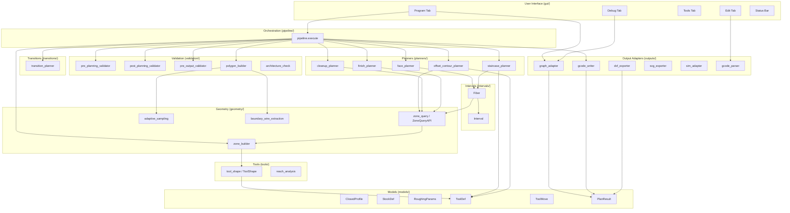
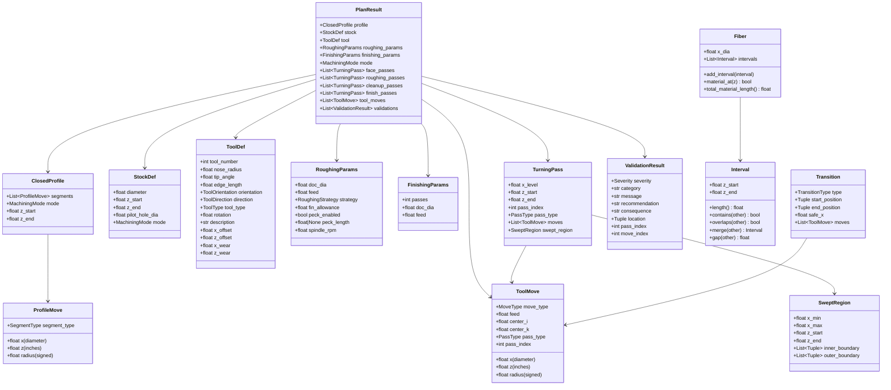

# Design Document: Industry CAM Engine Origin Spec

## Overview

Industry CAM Engine is a ground-up rebuild of the my-lathe CNC lathe CAM engine. It generates toolpaths for 2-axis lathe operations (OD/ID profiling, facing, roughing, cleanup, finishing) with a focus on geometric correctness, visual confirmation, and operator safety.

The system takes user-defined profile geometry and machining parameters, constructs machining zones via Build123d boolean operations, plans passes using Fiber/Interval boundary queries, validates every move against Shapely polygons at runtime, and outputs G-code alongside interactive PyQtGraph visualization.

**Key architectural decisions:**
- Build123d (OCCT) is the single source of geometric truth — no hand math
- Shapely validates every move at runtime (not test-only) — the hard safety floor
- PyQtGraph provides interactive vector-based visualization as a first-class architectural component
- The pipeline produces an immutable `PlanResult` that feeds all outputs (graph, G-code, DXF, diagnostics)
- OD and ID modes share one code path parameterized by a `mode` enum
- Two roughing strategies (staircase and offset-contour) share one interface

**Target environment:** Python 3.13, PyQt5, Windows development with Linux deployment (LinuxCNC).

## Architecture

### System Architecture Diagram



### Module Dependency Chain (Strict)

```
models → tools → geometry → intervals → planners → transitions → validation → outputs → pipeline → gui
```

Each module imports ONLY from modules to its left. No exceptions, no circular dependencies.

| Module | External Dependencies | Imports From |
|--------|----------------------|--------------|
| `models/` | None | Nothing |
| `tools/` | None | `models/` |
| `geometry/` | build123d, OCP | `models/`, `tools/` |
| `intervals/` | None | `models/`, `geometry/` |
| `planners/` | None | `models/`, `tools/`, `intervals/` |
| `transitions/` | None | `models/`, `intervals/` |
| `validation/` | shapely | `models/`, `geometry/` |
| `outputs/` | ezdxf, matplotlib | `models/` |
| `pipeline/` | None | All above |
| `gui/` | pyqtgraph, PyQt5 | `outputs/`, `pipeline/`, `models/` |

### Data Flow

```mermaid
flowchart LR
    UI[UI Fields] --> MB[model_builder]
    MB --> CP[ClosedProfile + StockDef + RoughingParams + ToolDef]
    CP --> PE[pipeline.execute]
    PE --> BZ[geometry.build_zones → ZoneSet]
    BZ --> BP[validation.build_polygons → ShapelyPolygons]
    BP --> FP[planners.plan_face → FaceResult]
    FP --> TP[planners.plan_turning → TurningResult]
    TP --> CL[planners.plan_cleanup → CleanupMoves]
    CL --> FN[planners.plan_finish → FinishMoves]
    FN --> TR[transitions.plan_transitions]
    TR --> VV[validation.verify_all_moves]
    VV --> PR[PlanResult - immutable]
    PR --> GC[gcode_writer.write → G-code text]
    PR --> GA[graph_adapter.convert → GraphData]
    GA --> PQG[gui/ PyQtGraph renders]
    PR --> DX[dxf_exporter → DXF file]
```



## Components and Interfaces

### models/ — Pure Data Structures

Zero external dependencies. All fields are typed. All classes are frozen dataclasses or have controlled mutability.

#### models/profile.py

```python
from dataclasses import dataclass
from enum import Enum
from typing import List

class SegmentType(Enum):
    LINE = "line"
    ARC = "arc"

class MachiningMode(Enum):
    OD = "od"
    ID = "id"

@dataclass(frozen=True)
class ProfileMove:
    """A single segment in the user's profile definition."""
    segment_type: SegmentType
    x: float          # End X position (DIAMETER)
    z: float          # End Z position (inches)
    radius: float = 0.0  # Arc radius (RADIUS, signed: +CW, -CCW). 0 for lines.

@dataclass(frozen=True)
class ClosedProfile:
    """Complete user profile with closure segments appended at generation time."""
    segments: List[ProfileMove]       # User-defined segments only
    corner_breaks: List[Optional['CornerBreak']]  # One per junction (len = len(segments) - 1)
    mode: MachiningMode
    z_start: float = 0.0             # Always 0.0 (enforced by validation)
    z_end: float = 0.0               # Most negative Z (user input)

class CornerBreakType(Enum):
    NONE = "none"
    FILLET = "fillet"
    CHAMFER = "chamfer"

@dataclass(frozen=True)
class CornerBreak:
    """Corner break definition between two adjacent segments.
    Applied during zone construction by Build123d fillet/chamfer operations.
    P1.5 feature — data model present from day one, geometry computation added after pipeline verification.
    """
    break_type: CornerBreakType
    radius: float = 0.0       # Fillet radius (inches). Used when type=FILLET.
    size: float = 0.0         # Chamfer size (inches along each segment). Used when type=CHAMFER.
    angle: float = 45.0       # Chamfer angle (degrees). Used when type=CHAMFER.
```

#### models/stock.py

```python
@dataclass(frozen=True)
class StockDef:
    """Stock material definition and approach/park positions."""
    diameter: float          # Stock OD (DIAMETER, inches)
    z_start: float           # Z approach position / True Face Zone Z+ boundary (positive, e.g., 0.100)
    z_end: float             # Most negative Z (inches, negative)
    x_start: float           # X approach position / True Face Zone inner X boundary (DIAMETER)
    x_park: float = 3.0      # X park position (DIAMETER, safe retract)
    z_park: float = 3.0      # Z park position (inches, safe retract)
    pilot_hole_dia: float = 0.0  # ID mode: pilot hole diameter. 0 = no pilot hole.
    mode: MachiningMode = MachiningMode.OD
```

#### models/tool.py

```python
class ToolOrientation(Enum):
    """LinuxCNC tool orientation codes 1-9."""
    OD_FRONT_RIGHT = 1
    OD_FRONT_LEFT = 2
    OD_BACK_RIGHT = 3
    OD_BACK_LEFT = 4
    ID_FRONT_RIGHT = 5
    ID_FRONT_LEFT = 6
    ID_BACK_RIGHT = 7
    ID_BACK_LEFT = 8
    CENTER = 9

class ToolDirection(Enum):
    RIGHT = "R"
    LEFT = "L"
    NEUTRAL = "N"

class ToolType(Enum):
    TURNING = "turning"
    BORING = "boring"
    THREADING = "threading"
    GROOVING = "grooving"

@dataclass(frozen=True)
class ToolDef:
    """Complete tool geometry definition — single source of truth."""
    tool_number: int
    nose_radius: float           # TNR (inches)
    tip_angle: float             # Included angle (degrees)
    edge_length: float           # Cutting edge length (inches)
    orientation: ToolOrientation
    direction: ToolDirection
    tool_type: ToolType = ToolType.TURNING
    rotation: float = 0.0        # Tool rotation about tip (degrees, 0-360)
    description: str = ""
    x_offset: float = 0.0       # X offset (diameter, inches)
    z_offset: float = 0.0       # Z offset (inches)
    x_wear: float = 0.0         # X wear comp (diameter, inches)
    z_wear: float = 0.0         # Z wear comp (inches)
```

#### models/params.py

```python
class RoughingStrategy(Enum):
    STAIRCASE = "staircase"
    OFFSET_CONTOUR = "offset_contour"

@dataclass(frozen=True)
class RoughingParams:
    """Parameters controlling roughing pass generation."""
    doc_dia: float               # Depth of cut (DIAMETER per pass)
    feed: float                  # Feed rate (inches/rev)
    strategy: RoughingStrategy
    fin_allowance: float = 0.005  # Finish allowance (RADIUS)
    peck_enabled: bool = False
    peck_length: float | None = None  # Inches along toolpath
    spindle_rpm: float = 1200.0

@dataclass(frozen=True)
class FinishingParams:
    """Parameters controlling finish pass generation."""
    passes: int = 1
    doc_dia: float = 0.002       # Finish DOC (DIAMETER)
    feed: float = 0.003          # Finish feed (inches/rev)
```

#### models/moves.py

```python
class MoveType(Enum):
    RAPID = "rapid"         # G00
    FEED = "feed"           # G01
    ARC_CW = "arc_cw"      # G02
    ARC_CCW = "arc_ccw"     # G03

class PassType(Enum):
    FACE = "face"
    ROUGH = "rough"
    CLEANUP = "cleanup"
    FINISH = "finish"
    TRANSITION = "transition"

@dataclass(frozen=True)
class ToolMove:
    """A single machine movement — the atomic unit of the toolpath."""
    move_type: MoveType
    x: float                 # End X (DIAMETER)
    z: float                 # End Z (inches)
    feed: float = 0.0        # Feed rate (inches/rev). 0 for rapids.
    radius: float = 0.0      # Arc radius (signed: +CW, -CCW). 0 for linear.
    center_i: float = 0.0    # Arc center X offset (DIAMETER, incremental from start)
    center_k: float = 0.0    # Arc center Z offset (inches, incremental from start)
    pass_type: PassType = PassType.ROUGH
    pass_index: int = 0      # Which pass this move belongs to
```

#### models/results.py

```python
from typing import List, Optional, Tuple

@dataclass(frozen=True)
class TurningPass:
    """A single roughing or cleanup pass."""
    x_level: float           # X diameter of this pass
    z_start: float           # Z start (higher Z, toward face)
    z_end: float             # Z end (lower Z, into workpiece)
    pass_index: int
    pass_type: PassType
    moves: List[ToolMove]    # The actual moves for this pass
    swept_region: Optional['SweptRegion'] = None

@dataclass(frozen=True)
class SweptRegion:
    """Material removed by a single pass."""
    x_min: float             # Inner X bound (diameter)
    x_max: float             # Outer X bound (diameter)
    z_start: float           # Z start
    z_end: float             # Z end
    # For offset-contour: inner/outer boundary coordinate arrays
    inner_boundary: Optional[List[Tuple[float, float]]] = None
    outer_boundary: Optional[List[Tuple[float, float]]] = None

@dataclass(frozen=True)
class PlanResult:
    """Immutable output of pipeline.execute(). Feeds all output adapters."""
    profile: ClosedProfile
    stock: StockDef
    tool: ToolDef
    roughing_params: RoughingParams
    finishing_params: FinishingParams
    mode: MachiningMode
    
    # Planned passes
    face_passes: List[TurningPass]
    roughing_passes: List[TurningPass]
    cleanup_passes: List[TurningPass]
    finish_passes: List[TurningPass]
    
    # Complete ordered toolpath
    tool_moves: List[ToolMove]
    
    # Zone boundary data (for graph adapter and validation)
    finished_part_boundary: List[Tuple[float, float]]
    finish_allowance_boundary: List[Tuple[float, float]]
    material_to_rough_boundary: List[Tuple[float, float]]
    stock_boundary: List[Tuple[float, float]]
    profile_boundary: List[Tuple[float, float]]
    
    # Validation results
    validations: List['ValidationResult']
    warnings_overridden: bool = False
    
    # Metadata
    generation_time_ms: float = 0.0
    pass_count: int = 0
    move_count: int = 0
```

#### models/validation.py

```python
class Severity(Enum):
    ERROR = "error"
    WARNING = "warning"

class PipelineStatus(Enum):
    SUCCESS = "success"
    SUCCESS_WITH_WARNINGS = "success_with_warnings"
    BLOCKED_BY_ERROR = "blocked_by_error"
    CANCELLED_BY_USER = "cancelled_by_user"

@dataclass(frozen=True)
class ValidationResult:
    """A single validation finding — error or warning."""
    severity: Severity
    category: str            # "geometry", "safety", "tool_reach", "engagement", etc.
    message: str             # Machinist-readable description
    recommendation: Optional[str] = None
    consequence: Optional[str] = None
    location: Optional[Tuple[float, float]] = None  # (x_dia, z)
    pass_index: Optional[int] = None
    move_index: Optional[int] = None

@dataclass(frozen=True)
class PipelineResult:
    """Top-level result from pipeline.execute()."""
    plan_result: Optional[PlanResult]
    validations: List[ValidationResult]
    warnings_overridden: bool
    status: PipelineStatus
```

#### models/transitions.py

```python
class TransitionType(Enum):
    RETRACT_TRAVERSE_PLUNGE = "retract_traverse_plunge"
    PERPENDICULAR_LINK = "perpendicular_link"
    STEP_OVER = "step_over"

@dataclass(frozen=True)
class Transition:
    """Movement between two cutting passes."""
    type: TransitionType
    start_position: Tuple[float, float]  # (x_dia, z)
    end_position: Tuple[float, float]    # (x_dia, z)
    safe_x: float                        # Retract X level (diameter)
    moves: List[ToolMove]                # Actual moves implementing this transition
```

#### models/constants.py

```python
# System operating tolerance — closure gaps, interval merging, point comparisons
TOLERANCE: float = 0.0005  # inches

# Area threshold for oracle coverage/gouge checks
TOLERANCE_SQ: float = TOLERANCE ** 2  # 0.00000025 sq in

# LinuxCNC's IJK arc acceptance window
CENTER_ARC_RADIUS_TOLERANCE_INCH: float = 0.00283

# LinuxCNC's R-format arc tolerance
RADIUS_TOLERANCE: float = 0.00005

# Zone shading tessellation maximum chord error
DISPLAY_TOLERANCE: float = 0.001  # inches

# Shapely polygon maximum chord error (cos_limit=0.9999)
DENSIFICATION_ERROR: float = 0.000025  # inches

# Adaptive densification cosine limit for Shapely polygons
SHAPELY_COS_LIMIT: float = 0.9999

# Adaptive densification cosine limit for display
DISPLAY_COS_LIMIT: float = 0.999

# Maximum recursion depth for adaptive densification
MAX_DENSIFICATION_DEPTH: int = 12

# Display densification max depth
MAX_DISPLAY_DEPTH: int = 10
```


### tools/ — Tool Geometry and Reach Analysis

```python
# tools/tool_shape.py

class ToolShape:
    """Computes the tool's physical geometry as a segment group.
    Modeled after liblathe's Tool.get_segmentgroup().
    """
    
    def __init__(self, tool_def: ToolDef):
        self._def = tool_def
        self._segments = self._compute_segments()
    
    def get_reach_boundary(self) -> List[Tuple[float, float]]:
        """The envelope of positions the tool tip can reach given physical constraints.
        Returns coordinate pairs (x_radius, z) defining the reach boundary.
        """
        ...
    
    def get_compensation_offset(self, segment_angle: float, mode: MachiningMode) -> float:
        """DEPRECATED — TNR compensation is handled by LinuxCNC G41/G42.
        This method is retained only for reach analysis (determining if the tool
        can physically fit in concave geometry). It does NOT affect toolpath coordinates.
        Returns the TNR offset in RADIUS units for analysis purposes only.
        """
        ...
    
    def can_reach(self, x_dia: float, z: float, profile_curvature: float) -> bool:
        """Whether the tool can physically cut at this position given local geometry.
        Raises ToolReachError if nose_radius > min_concave_radius.
        """
        ...
    
    def _compute_segments(self) -> List[Tuple[Tuple[float, float], Tuple[float, float]]]:
        """Compute the tool's physical outline as line segments.
        Based on tip_angle, edge_length, nose_radius, orientation.
        """
        ...
```

### geometry/ — Build123d Zone Construction and Query API

The ONLY module that imports Build123d/OCCT. Provides two main components:

```python
# geometry/zone_builder.py

from build123d import Face, Wire, Sketch, Line, RadiusArc, Plane

class ZoneSet:
    """The complete set of machining zones constructed from profile + stock."""
    finished_part: Face
    finish_allowance: Face
    material_to_rough: Face
    true_face: Face
    stock_face: Face
    roughing_boundary_wire: Wire
    profile_boundary_wire: Wire

def build_zones(
    profile: ClosedProfile,
    stock: StockDef,
    tool: ToolDef,
    roughing_params: RoughingParams,
) -> ZoneSet:
    """Construct all machining zones using Build123d boolean operations on 2D Faces.
    
    Steps:
    1. Build closed profile contour (user segments + closure segments)
    2. Create Finished Part face from closed contour
    3. Offset profile by fin_allowance → Roughing Boundary (TNR handled by G41/G42, not coordinate offset)
    4. Create Stock face from stock parameters
    5. Boolean subtract: Material to Rough = Stock - Finished Part - Finish Allowance
    6. Create True Face zone from X_start, Z_start, Stock_OD, Z=0
    
    All coordinates in RADIUS for Build123d sketch plane.
    """
    ...

def _append_closure_segments(
    profile: ClosedProfile, stock: StockDef
) -> List[Tuple[float, float]]:
    """Compute the 3 closure line segments based on mode.
    
    OD: profile_end → centerline → Z=0 → profile_start
    ID: profile_end → stock_OD → Z=0 → profile_start
    
    Returns coordinate pairs in RADIUS.
    """
    ...
```

```python
# geometry/zone_query.py

class ZoneQueryAPI:
    """Direct geometric query interface wrapping OCCT operations against Build123d Faces.
    All inputs in DIAMETER for X, INCHES for Z.
    All outputs in INCHES for Z values.
    """
    
    def __init__(self, zone_set: ZoneSet):
        self._zones = zone_set
    
    def boundary_at_x(self, x_dia: float, zone_name: str = "material_to_rough") -> List[Tuple[float, float]]:
        """Query Z boundaries where a horizontal line at x_dia intersects the zone.
        Returns list of (z_start, z_end) interval pairs, sorted by Z descending.
        Uses BRepAlgoAPI_Section internally.
        """
        ...
    
    def line_zone_intersection(
        self, start: Tuple[float, float], end: Tuple[float, float], zone_name: str
    ) -> bool:
        """Check if a line segment intersects a zone boundary.
        start/end are (x_dia, z) tuples.
        Returns True if intersection exists.
        """
        ...
    
    def offset_boundary(self, distance: float) -> Wire:
        """Offset the roughing boundary outward by distance (RADIUS).
        Uses Build123d's offset operation — never manual coordinate shifting.
        """
        ...
    
    def boundary_wire_extraction(self, zone_name: str) -> List['EdgeData']:
        """Extract boundary edges from a zone Face for Shapely polygon construction.
        Returns EdgeData objects with type (LINE/ARC), start, end, center, radius.
        """
        ...
```

```python
# geometry/adaptive_sampling.py

def adaptive_densify_arc(
    start: Tuple[float, float],
    end: Tuple[float, float],
    center: Tuple[float, float],
    radius: float,
    cos_limit: float = 0.9999,
    max_depth: int = 12,
) -> List[Tuple[float, float]]:
    """Recursively bisect an arc until the cosine-limit flatness predicate is satisfied.
    
    flat(start, mid, end) = dot(normalize(mid-start), normalize(end-mid)) > cos_limit
    
    Returns densified point list (includes start and end).
    Guarantees max chord error < R × (1 - cos_limit) ≈ R × 0.0001 for cos_limit=0.9999.
    """
    ...

def flatness_predicate(
    start: Tuple[float, float],
    mid: Tuple[float, float],
    end: Tuple[float, float],
    cos_limit: float,
) -> bool:
    """OpenCamLib-style cosine-limit flatness test.
    Returns True if the three points are 'flat enough' (no further bisection needed).
    """
    ...
```

### intervals/ — Fiber and Interval Classes

```python
# intervals/interval.py

@dataclass
class Interval:
    """A contiguous material region along a Fiber.
    z_start > z_end (z_start is higher/closer to face).
    """
    z_start: float  # Higher Z (toward face)
    z_end: float    # Lower Z (into workpiece)
    
    @property
    def length(self) -> float:
        return self.z_start - self.z_end
    
    def contains(self, other: 'Interval') -> bool:
        """True if other is fully inside self (within TOLERANCE)."""
        ...
    
    def overlaps(self, other: 'Interval') -> bool:
        """True if any overlap exists (within TOLERANCE)."""
        ...
    
    def merge(self, other: 'Interval') -> 'Interval':
        """Union of two overlapping intervals. Raises if no overlap."""
        ...
    
    def gap(self, other: 'Interval') -> float:
        """Distance between non-overlapping intervals. 0 if overlapping."""
        ...
```

```python
# intervals/fiber.py

class Fiber:
    """A query line at a fixed X level (diameter) that collects Intervals.
    Modeled after OpenCamLib's Fiber class.
    """
    
    def __init__(self, x_dia: float, zone_query: ZoneQueryAPI):
        self._x_dia = x_dia
        self._intervals: List[Interval] = []
        self._query(zone_query)
    
    @property
    def x_dia(self) -> float:
        return self._x_dia
    
    @property
    def intervals(self) -> List[Interval]:
        """Sorted list of non-overlapping Intervals (z_start descending)."""
        return sorted(self._intervals, key=lambda i: -i.z_start)
    
    def add_interval(self, interval: Interval) -> None:
        """Add interval with automatic merge of overlapping intervals.
        Uses TOLERANCE = 0.0005" for merge decisions.
        """
        ...
    
    def material_at(self, z: float) -> bool:
        """Point-in-material test at this fiber's X level."""
        ...
    
    @property
    def total_material_length(self) -> float:
        """Sum of all interval lengths."""
        return sum(i.length for i in self._intervals)
    
    def _query(self, zone_query: ZoneQueryAPI) -> None:
        """Obtain intervals from ZoneQueryAPI.boundary_at_x() — never manual computation."""
        boundaries = zone_query.boundary_at_x(self._x_dia)
        for z_start, z_end in boundaries:
            self.add_interval(Interval(z_start, z_end))
```

### planners/ — Pass Planning

```python
# planners/protocols.py

from typing import Protocol, List
from models.moves import ToolMove
from models.results import TurningPass

class RoughingPlanner(Protocol):
    """Interface for roughing strategy implementations."""
    
    def plan(
        self,
        fibers: List[Fiber],
        tool: ToolDef,
        params: RoughingParams,
        stock: StockDef,
        mode: MachiningMode,
    ) -> List[TurningPass]:
        """Generate roughing passes. Returns ordered list of passes."""
        ...
```

```python
# planners/staircase_planner.py

class StaircasePlanner:
    """Constant-X passes with variable Z boundaries.
    Proven approach carried forward from my-lathe.
    """
    
    def plan(
        self,
        fibers: List[Fiber],
        tool: ToolDef,
        params: RoughingParams,
        stock: StockDef,
        mode: MachiningMode,
    ) -> List[TurningPass]:
        """Generate staircase roughing passes.
        
        Algorithm:
        1. Compute X levels: stock_dia, stock_dia - doc, stock_dia - 2*doc, ...
        2. At each X level, query Fiber for material intervals
        3. Each interval becomes one pass at that X level (z_start to z_end)
        4. Passes ordered: outermost X first, then by Z (face-to-tail)
        """
        ...
```

```python
# planners/offset_contour_planner.py

class OffsetContourPlanner:
    """Equidistant offsets from profile, clipped to stock.
    New adaptive approach — engagement angle stays approximately constant.
    """
    
    def plan(
        self,
        zone_query: ZoneQueryAPI,
        tool: ToolDef,
        params: RoughingParams,
        stock: StockDef,
        mode: MachiningMode,
    ) -> List[TurningPass]:
        """Generate offset-contour roughing passes.
        
        Algorithm:
        1. Start from roughing boundary (keep_zone boundary)
        2. Offset outward by DOC increments toward stock
        3. Clip each offset contour to stock boundary
        4. Each clipped contour = one roughing pass
        5. Arcs remain arcs, lines remain lines (kernel offset preserves geometry type)
        6. Last offset pass ≈ cleanup (at fin_allowance offset)
        7. Finish pass at zero offset = profile boundary
        """
        ...
```

```python
# planners/face_planner.py

class FacePlanner:
    """Plans face passes to remove the True Face Zone."""
    
    def plan(
        self,
        stock: StockDef,
        tool: ToolDef,
        params: RoughingParams,
        mode: MachiningMode,
        zone_query: ZoneQueryAPI,
    ) -> List[TurningPass]:
        """Generate face passes.
        
        OD: Feed from stock OD toward centerline at Z=0, stepping Z by DOC
        ID: Feed from pilot hole toward x_start at Z=0, stepping Z by DOC
        """
        ...
```

```python
# planners/cleanup_planner.py

class CleanupPlanner:
    """Plans the cleanup pass (profile-following at fin_allowance offset).
    Only used with staircase strategy — offset-contour eliminates the need.
    """
    
    def plan(
        self,
        zone_query: ZoneQueryAPI,
        tool: ToolDef,
        params: RoughingParams,
        mode: MachiningMode,
    ) -> List[TurningPass]:
        """Generate cleanup pass following the roughing boundary contour.
        Uses boundary_wire_extraction to get the exact roughing boundary shape.
        """
        ...
```

```python
# planners/finish_planner.py

class FinishPlanner:
    """Plans the finish pass (profile-following at zero offset)."""
    
    def plan(
        self,
        zone_query: ZoneQueryAPI,
        tool: ToolDef,
        finishing_params: FinishingParams,
        mode: MachiningMode,
    ) -> List[TurningPass]:
        """Generate finish pass(es) following the profile boundary exactly.
        Uses boundary_wire_extraction to get the exact profile shape.
        """
        ...
```

### transitions/ — Retract/Approach/Link Logic

**Dependency Injection Note:** This module does NOT import from `geometry/`. The `ZoneQueryAPI` object is received as a parameter from `pipeline/` (dependency injection). This maintains the strict dependency chain: `transitions/` imports only `models/` and `intervals/`. The type annotation uses a string literal (`'ZoneQueryAPI'`) or a Protocol to avoid the import.

```python
# transitions/transition_planner.py

class TransitionPlanner:
    """Plans movements between cutting passes.
    Uses ZoneQueryAPI for safety verification — never geometric assumptions.
    """
    
    def plan_transition(
        self,
        from_pass: TurningPass,
        to_pass: TurningPass,
        mode: MachiningMode,
        stock: StockDef,
        zone_query: ZoneQueryAPI,
        strategy: RoughingStrategy,
    ) -> Transition:
        """Determine transition type and generate moves.
        
        RETRACT_TRAVERSE_PLUNGE: Standard safe transition
          1. Retract X to safe level
          2. Traverse Z at safe X
          3. Approach X to previous cleared level
          4. Feed step-down to next pass X
        
        PERPENDICULAR_LINK: Offset-contour only
          1. Feed perpendicular from current contour end to next contour start
          2. No retract (tool stays in material)
        
        STEP_OVER: Adjacent passes at same Z
          1. Feed step-down (verify DOC not exceeded)
        """
        ...
    
    def _get_safe_x(self, mode: MachiningMode, stock: StockDef) -> float:
        """Safe retract X level parameterized by mode.
        OD: stock_dia (or stock_dia + clearance)
        ID: pilot_hole_dia (or pilot_hole_dia - clearance)
        """
        ...
    
    def _verify_transition_safety(
        self, transition: Transition, zone_query: ZoneQueryAPI
    ) -> None:
        """Verify transition moves don't violate zone rules.
        Uses line_zone_intersection() — never geometric assumptions.
        Raises RuntimeError if unsafe.
        """
        ...
```

### validation/ — Shapely Runtime Safety Checking

```python
# validation/polygon_builder.py

from shapely.geometry import Polygon, Point, LineString

class ValidationPolygons:
    """Shapely polygons constructed from Build123d zone boundaries.
    Cached — constructed once after build_zones(), never reconstructed per-query.
    """
    finished_part_poly: Polygon
    finish_allowance_poly: Polygon
    material_to_rough_poly: Polygon
    
    @classmethod
    def from_zone_set(cls, zone_set: ZoneSet, zone_query: ZoneQueryAPI) -> 'ValidationPolygons':
        """Construct Shapely polygons from zone boundary wires.
        
        For LINE edges: exact start/end coordinates
        For ARC edges: adaptive densification with cos_limit=0.9999
          - Max chord error < 0.000025" (50× tighter than TOLERANCE)
          - Inscribed-chord property: polygon is conservative (smaller) approximation
          - Recursion depth limit: 12
        
        Performance target: < 10ms for profiles with up to 20 arc segments.
        """
        ...
```

```python
# validation/pre_planning_validator.py

def validate_profile(profile: ClosedProfile, stock: StockDef) -> List[ValidationResult]:
    """Pre-planning geometry validation.
    
    Checks:
    - Arc radius >= chord_length / 2 for every ARC segment
    - Arc center is computable (discriminant >= 0)
    - Profile closure gap <= TOLERANCE
    - No self-intersecting segments
    - All X values positive (diameter convention)
    - Profile starts at Z=0, ends at Z_end
    - OD: profile X <= stock_dia
    - ID: profile X >= pilot_hole_dia
    """
    ...
```

```python
# validation/post_planning_validator.py

def validate_all_moves(
    moves: List[ToolMove],
    polygons: ValidationPolygons,
    mode: MachiningMode,
) -> List[ValidationResult]:
    """Post-planning safety validation using Shapely polygons.
    Checks EVERY move — not spot-checks.
    
    For each move:
    - Endpoint NOT in finished_part_poly
    - Start point NOT in finished_part_poly
    - Rapid segment does NOT intersect finished_part_poly boundary
    - Feed segment does NOT intersect finished_part_poly
    - At least one point per pass IS in material_to_rough_poly
    """
    ...
```

```python
# validation/pre_output_validator.py

def validate_gcode_geometry(moves: List[ToolMove]) -> List[ValidationResult]:
    """Pre-output G-code geometry validation.
    
    Checks:
    - No zero-length moves (start == end within TOLERANCE)
    - Arc endpoint distance from center matches radius within CENTER_ARC_RADIUS_TOLERANCE
    - No consecutive identical positions
    - Feed rate set before first feed move
    - All coordinates finite (no NaN, no Inf)
    """
    ...
```

### outputs/ — G-Code Writer, Graph Adapter, Exporters

```python
# outputs/gcode_writer.py

class GCodeWriter:
    """Position-tracking G-code writer.
    Modeled after Bapt_CAM's GcodeWriter.
    
    - Tracks current position (X, Z) and feed rate
    - Suppresses unchanged axis words
    - Suppresses unchanged feed rate
    - Detects and rejects zero-motion moves
    - Validates arc geometry before emitting
    - Supports R-format and IJK-format arcs
    """
    
    def __init__(self, arc_format: str = "ijk"):
        self._x: float | None = None
        self._z: float | None = None
        self._feed: float | None = None
        self._arc_format = arc_format  # "ijk" or "r"
        self._lines: List[str] = []
    
    def write(self, plan_result: PlanResult) -> str:
        """Generate complete G-code program from PlanResult.
        
        Structure:
        - Header (program info, warnings, parameters)
        - G40 (cutter compensation cancel — safety reset)
        - S[rpm] (spindle speed for encoder sync)
        - G00 to X_park, Z_park (safe start)
        - Tool call (T## M6, G43)
        - G41/G42 (cutter compensation on — active for ALL passes)
        - G00 to X_start, Z_start (approach position)
        - Face passes (with section comment)
        - Roughing passes (with section comment)
        - Cleanup pass (with section comment, staircase only)
        - G00 to park, tool change to finisher
        - G41/G42 (cutter compensation on for finish tool)
        - G00 to X_start, Z_start
        - Finish pass (with section comment)
        - G40 (cutter compensation cancel)
        - G00 to X_park, Z_park
        - Footer (M2 program end)
        """
        ...
    
    def _emit_move(self, move: ToolMove, start_x: float, start_z: float) -> str:
        """Emit a single G-code line with position tracking and suppression."""
        ...
    
    def _validate_arc(self, move: ToolMove, start_x: float, start_z: float) -> None:
        """Validate arc geometry before emitting. Raises on invalid arc."""
        ...
```

```python
# outputs/graph_adapter.py
# NOTE: This module does NOT import PyQtGraph or Qt.
# It produces plain coordinate arrays that gui/ consumes.

@dataclass
class ZoneShading:
    """Polygon coordinate arrays for zone fill rendering."""
    zone_name: str
    x_coords: List[float]  # RADIUS
    z_coords: List[float]  # INCHES
    color_key: str          # Key into COLORS dict

@dataclass
class ToolpathSegment:
    """A contiguous segment of the toolpath with uniform move type."""
    x_coords: List[float]  # RADIUS
    z_coords: List[float]  # INCHES
    move_type: MoveType
    pass_type: PassType
    pass_index: int

@dataclass
class PlaybackFrame:
    """A single frame in animated playback."""
    move_index: int
    x: float  # RADIUS
    z: float  # INCHES
    pass_type: PassType
    n_number: int

@dataclass
class GraphData:
    """Complete data package for PyQtGraph rendering.
    All X coordinates in RADIUS. All Z in INCHES.
    """
    zone_shadings: List[ZoneShading]
    toolpath_segments: List[ToolpathSegment]
    profile_line: Tuple[List[float], List[float]]  # (x_radius[], z[])
    stock_rect: Tuple[float, float, float, float]  # (x_min_r, x_max_r, z_min, z_max)
    centerline_z_range: Tuple[float, float]
    playback_frames: List[PlaybackFrame]
    warning_regions: List[Tuple[List[float], List[float]]]
    swept_regions: List[Tuple[List[float], List[float]]]

def convert(plan_result: PlanResult) -> GraphData:
    """Convert PlanResult into PyQtGraph-ready coordinate arrays.
    
    - Converts all X from DIAMETER to RADIUS (÷ 2.0)
    - Densifies arc segments using adaptive_densify_arc (cos_limit=0.9999)
    - Groups moves by type for color-coded rendering
    - Constructs playback frame sequence
    - Extracts zone boundaries as polygon coordinate arrays
    
    Performance budget: < 50ms for typical profiles.
    """
    ...

def convert_from_moves(moves: List[ToolMove]) -> GraphData:
    """Convert a raw move list (e.g., from gcode_parser) into GraphData.
    Used by Edit tab preview and round-trip overlay.
    """
    ...
```

```python
# outputs/gcode_parser.py

def parse(gcode_text: str) -> List[ToolMove]:
    """Parse G-code text back into ToolMove list.
    
    Handles the engine's own output format:
    - G00, G01, G02, G03 (modal)
    - X, Z axis words (absolute, diameter mode)
    - I, K (incremental arc center) and R (radius) formats
    - F (feed rate, modal)
    - Comments (ignored for geometry, parsed for metadata)
    
    LinuxCNC interpretation rules:
    - G90 mode assumed (absolute)
    - I/K incremental from start point
    - Feed rate persists until changed
    
    Intentionally minimal — only parses the engine's own output.
    """
    ...
```

### pipeline/ — Orchestration

```python
# pipeline/pipeline.py

def execute(
    profile: ClosedProfile,
    stock: StockDef,
    tool: ToolDef,
    roughing_params: RoughingParams,
    finishing_params: FinishingParams,
    verify_roundtrip: bool = False,
) -> PipelineResult:
    """Execute the full CAM pipeline.
    
    Steps:
    1. Pre-planning validation (profile geometry)
    2. Build zones (geometry/zone_builder)
    2b. Extract zone boundary coordinates for PlanResult:
        - finished_part_boundary = zone_query.boundary_wire_extraction("finished_part")
        - finish_allowance_boundary = zone_query.boundary_wire_extraction("finish_allowance")
        - material_to_rough_boundary = zone_query.boundary_wire_extraction("material_to_rough")
        - profile_boundary = zone_query.boundary_wire_extraction("profile")
        - stock_boundary = simple rectangle from stock params
    3. Build validation polygons (validation/polygon_builder)
    4. Plan face passes (planners/face_planner)
    5. Plan roughing passes (planners/staircase or offset_contour)
    6. Plan cleanup pass (planners/cleanup_planner, staircase only)
    7. Plan finish pass (planners/finish_planner)
    8. Plan transitions between all passes (transitions/)
    9. Assemble complete move list
    10. Post-planning validation (Shapely — every move checked)
    11. Pre-output validation (G-code geometry)
    12. Construct immutable PlanResult (includes zone boundaries from step 2b)
    13. Optional: round-trip verification
    
    If any ERROR validation: return PipelineResult with status=BLOCKED_BY_ERROR
    If only WARNINGs: return with status=SUCCESS_WITH_WARNINGS (GUI prompts user)
    """
    ...
```

```python
# pipeline/model_builder.py

def build_from_fields(
    segments: List[dict],        # [{"type": "line", "x": 1.0, "z": -0.5}, ...]
    stock_dia: float,
    z_start: float,
    z_end: float,
    mode: str,                   # "od" or "id"
    pilot_hole_dia: float,
    doc_dia: float,
    feed: float,
    strategy: str,               # "staircase" or "offset_contour"
    fin_allowance: float,
    peck_enabled: bool,
    peck_length: float | None,
    spindle_rpm: float,
    finish_passes: int,
    finish_doc_dia: float,
    finish_feed: float,
    tool_def: ToolDef,
) -> Tuple[ClosedProfile, StockDef, RoughingParams, FinishingParams]:
    """Convert raw UI field values into typed dataclasses.
    
    This is the ONLY place where:
    - String → Enum conversion happens (mode, strategy)
    - Field completeness is checked (raises ValueError on missing required fields)
    - Segment dicts → ProfileMove conversion happens
    
    No Qt imports — testable without a display.
    Lives in pipeline/ so it's accessible to both gui/ and tests/.
    """
    ...
```

```python
# pipeline/file_io.py

def save_conversational(data: dict, path: str) -> None:
    """Save conversational program as JSON.
    Writes with indent=2 for human readability.
    Updates 'modified' timestamp.
    """
    ...

def load_conversational(path: str) -> dict:
    """Load conversational program from JSON.
    Returns raw dict — model_builder converts to dataclasses.
    Validates 'version' field for forward compatibility.
    """
    ...

def save_tool_table(tools: List[ToolDef], path: str) -> None:
    """Save tool table in LinuxCNC .tbl format."""
    ...

def load_tool_table(path: str) -> List[ToolDef]:
    """Load tool table from .tbl format."""
    ...

def create_backup(source_path: str, backup_dir: str, max_backups: int = 5) -> str:
    """Create timestamped backup of a file.
    Filename: {stem}_{YYYY-MM-DD_HHMMSS}{suffix}
    Prunes oldest backups beyond max_backups.
    Returns the backup file path.
    """
    ...

def save_gcode(gcode_text: str, path: str) -> None:
    """Save G-code text to .ngc file."""
    ...
```

### gui/ — PyQtGraph Visualization and Qt UI

```python
# gui/graph_widget.py

import pyqtgraph as pg
from pyqtgraph.Qt import QtCore, QtWidgets

class MachiningGraphWidget(pg.PlotWidget):
    """Reusable graph widget for Program Tab and Debug Tab.
    
    Shared behavior:
    - Zoom/pan with aspect ratio locked (1:1)
    - Crosshair with coordinate readout (radius + diameter for X)
    - Zone shading (FillBetweenItem)
    - Toolpath trace (PlotCurveItem per move type)
    - Profile boundary (bold white PlotCurveItem)
    - Stock boundary rectangle
    - Adaptive axis tick precision (PrecisionAxisItem)
    - Touch support (pinch-to-zoom, two-finger pan)
    
    Tab-specific behavior added by composition (playback, overlays, fiber chart).
    """
    
    # Signals
    coordinate_changed = QtCore.pyqtSignal(float, float)  # (x_radius, z)
    move_selected = QtCore.pyqtSignal(int)  # move_index
    
    def __init__(self, parent=None):
        ...
    
    def set_graph_data(self, data: GraphData) -> None:
        """Load complete graph data. Replaces all current display items."""
        ...
    
    def set_preview_mode(self, segments: List[ProfileMove], stock: StockDef) -> None:
        """Show real-time profile preview (Qt geometry, no kernel)."""
        ...
    
    def highlight_pass(self, pass_index: int) -> None:
        """Highlight a specific pass's swept region."""
        ...
    
    def set_tool_position(self, x_radius: float, z: float) -> None:
        """Update animated tool dot position during playback."""
        ...
```

#### Program Tab State Machine

```
States:
  IDLE        → No profile defined yet (fresh start or after "New")
  BUILDING    → Segments being added/edited, preview updating in real-time
  READY       → Valid profile (zero errors), "Generate" button enabled
  GENERATING  → Pipeline executing (progress bar visible, fields locked)
  DISPLAYING  → Toolpath visible, playback controls available
  PLAYING     → Playback active (fields locked, step/pause available)

Transitions:
  IDLE → BUILDING         : User adds first segment
  BUILDING → READY        : All validation errors cleared
  READY → BUILDING        : User introduces a validation error
  BUILDING → BUILDING     : User edits segment (preview updates)
  READY → GENERATING      : User clicks "Generate"
  GENERATING → DISPLAYING : Pipeline completes successfully
  GENERATING → READY      : Pipeline returns errors (shown inline)
  DISPLAYING → BUILDING   : User edits any input field (toolpath cleared)
  DISPLAYING → PLAYING    : User clicks "Play"
  PLAYING → DISPLAYING    : User clicks "Pause" or playback ends
  PLAYING → PLAYING       : User clicks "Step Forward/Back"
  DISPLAYING → IDLE       : User clicks "New" (with confirmation)
  Any → IDLE              : User clicks "New" (with confirmation if unsaved)
```

#### Inter-Tab Signal Map

```python
# gui/program_tab.py
class ProgramTab(QtWidgets.QWidget):
    # Emitted signals
    gcode_generated = QtCore.pyqtSignal(str)           # G-code text → Edit Tab receives
    plan_result_ready = QtCore.pyqtSignal(object)      # PlanResult → Debug Tab updates
    tool_requested = QtCore.pyqtSignal(int)            # Tool # → Tools Tab highlights

# gui/edit_tab.py
class EditTab(QtWidgets.QWidget):
    # Emitted signals
    preview_requested = QtCore.pyqtSignal(list)        # List[ToolMove] → Program Tab graph shows

# gui/tools_tab.py
class ToolsTab(QtWidgets.QWidget):
    # Emitted signals
    tool_changed = QtCore.pyqtSignal(int)              # Tool # → Program Tab marks stale

# gui/main_window.py — connects signals:
#   program_tab.gcode_generated → edit_tab.receive_gcode
#   program_tab.plan_result_ready → debug_tab.update_panels
#   tools_tab.tool_changed → program_tab.on_tool_changed
#   edit_tab.preview_requested → program_tab.show_parsed_preview
```

#### Playback Controller

```python
# gui/playback_controller.py

class PlaybackController(QtCore.QObject):
    """QTimer-based frame stepper for toolpath animation.
    
    Advances through PlaybackFrames at configurable speed.
    Emits position updates for the graph widget's tool dot.
    """
    
    # Signals
    frame_changed = QtCore.pyqtSignal(int, float, float, str, int)  # index, x_r, z, pass_type, n_number
    playback_finished = QtCore.pyqtSignal()
    
    def __init__(self, parent=None):
        self._timer = QtCore.QTimer()
        self._timer.timeout.connect(self._advance)
        self._frames: List[PlaybackFrame] = []
        self._current_index: int = 0
        self._speed: float = 1.0  # 0.5x to 5x
        self._base_interval_ms: int = 50  # 20 fps at 1x
    
    def load_frames(self, frames: List[PlaybackFrame]) -> None:
        """Load playback data from GraphData."""
        ...
    
    def play(self) -> None:
        """Start or resume playback."""
        self._timer.start(int(self._base_interval_ms / self._speed))
    
    def pause(self) -> None:
        """Pause playback (preserves position)."""
        self._timer.stop()
    
    def step_forward(self) -> None:
        """Advance one frame."""
        ...
    
    def step_backward(self) -> None:
        """Go back one frame."""
        ...
    
    def set_speed(self, multiplier: float) -> None:
        """Set playback speed (0.5, 1.0, 2.0, 5.0)."""
        ...
    
    def _advance(self) -> None:
        """Timer callback — emit next frame."""
        ...
```

```python
# gui/program_tab.py

class ProgramTab(QtWidgets.QWidget):
    """Conversational programming tab.
    
    Layout: QSplitter
    ├── Left panel: Input fields (stock, cutting params, segment list, block selector)
    └── Right panel: MachiningGraphWidget + playback controls (bottom strip)
    
    State machine: IDLE → BUILDING → READY → GENERATING → DISPLAYING ↔ PLAYING
    
    Block types (parent blocks):
    - OD Profile (P1)
    - ID Profile (P1)
    - Threading OD/ID (P2 — disabled)
    - Grooving OD/ID (P2 — disabled)
    """
    
    # Signals
    gcode_generated = QtCore.pyqtSignal(str)
    plan_result_ready = QtCore.pyqtSignal(object)
    tool_requested = QtCore.pyqtSignal(int)
    
    def __init__(self, parent=None):
        self._state = "IDLE"
        self._graph = MachiningGraphWidget()
        self._playback = PlaybackController()
        ...
    
    def _on_generate_clicked(self) -> None:
        """READY → GENERATING → DISPLAYING (or back to READY on error)."""
        self._state = "GENERATING"
        fields = self._read_all_fields()
        profile, stock, roughing, finishing = model_builder.build_from_fields(**fields)
        result = pipeline.execute(profile, stock, self._tool, roughing, finishing)
        if result.status == PipelineStatus.BLOCKED_BY_ERROR:
            self._show_errors(result.validations)
            self._state = "READY"
        else:
            self._graph.set_graph_data(graph_adapter.convert(result.plan_result))
            self._playback.load_frames(graph_adapter.convert(result.plan_result).playback_frames)
            self.plan_result_ready.emit(result.plan_result)
            self.gcode_generated.emit(gcode_writer.write(result.plan_result))
            self._state = "DISPLAYING"
    
    def _on_field_changed(self) -> None:
        """DISPLAYING → BUILDING (clear toolpath, update preview)."""
        if self._state == "DISPLAYING":
            self._graph.clear_toolpath()
            self._state = "BUILDING"
        self._update_preview()
        self._validate_inline()
    
    def _update_preview(self) -> None:
        """Update real-time profile preview. Pure Qt geometry, < 16ms."""
        segments = self._read_segments()
        stock = self._read_stock_fields()
        self._graph.set_preview_mode(segments, stock)
```

```python
# gui/debug_tab.py

class DebugTab(QtWidgets.QWidget):
    """Diagnostics tab with sub-panels.
    
    Sub-panels (horizontal tab bar):
    - Fibers: Interval chart
    - Swept: Cumulative swept region visualization
    - Heatmap: Clearance/distance visualization
    - Diagnostic: Structured text dump
    - Round-Trip: G-code fidelity comparison
    - Export: DXF, SVG, PNG, G-code→DXF
    
    All panels read the sealed PlanResult — no separate computation.
    Lazy-rendered: computed only when panel is selected.
    """
    
    def update_panels(self, plan_result: PlanResult) -> None:
        """Called when Program Tab emits plan_result_ready."""
        self._plan_result = plan_result
        self._invalidate_panels()  # Mark all panels as needing refresh
        if self._current_panel:
            self._render_current_panel()  # Only re-render the visible one
    ...
```

```python
# gui/edit_tab.py

class EditTab(QtWidgets.QWidget):
    """G-code text editor with syntax highlighting and preview.
    
    Features:
    - JetBrains Mono font, G-code syntax highlighting
    - Find/Replace (Ctrl+F)
    - File operations (Open, Save, Save As, Clear, Reload)
    - Preview button (parse → graph display)
    - Undo/Redo, line numbers, current line highlight
    - Handles up to 10,000 lines without lag
    """
    
    # Signals
    preview_requested = QtCore.pyqtSignal(list)  # List[ToolMove]
    
    def receive_gcode(self, gcode_text: str) -> None:
        """Called when Program Tab emits gcode_generated ("Send to Editor")."""
        self._editor.setPlainText(gcode_text)
        self._mark_unmodified()
    ...
```

```python
# gui/tools_tab.py

class ToolsTab(QtWidgets.QWidget):
    """Tool table management with geometry preview.
    
    Layout:
    ├── Tool list/grid (editable fields)
    └── Tool shape preview (QPainterPath — NOT engine ToolShape)
    
    Features:
    - Insert shape dropdown with auto-populate
    - Real-time tool graphic update
    - Offset and wear fields with visual distinction
    - Auto-save on every change + explicit Save/Save As
    - Session backup on launch (max 5)
    - LinuxCNC tool.tbl format compatibility
    """
    
    # Signals
    tool_changed = QtCore.pyqtSignal(int)  # tool_number that was modified
    
    def _on_field_edited(self, tool_number: int) -> None:
        """Auto-save and emit change signal."""
        self._auto_save()
        self.tool_changed.emit(tool_number)
    ...
```

```python
# gui/main_window.py

class MainWindow(QtWidgets.QMainWindow):
    """Main application window.
    
    Layout:
    ├── Status Bar (top, always visible)
    │   ├── Machine state indicators
    │   ├── Live DRO (X dia, Z inches)
    │   ├── Active G-codes
    │   └── Spindle RPM (from encoder, or "---" offline)
    ├── Tab Bar
    │   ├── Program (P1)
    │   ├── Edit (P1)
    │   ├── Tools (P1)
    │   ├── Debug (P1)
    │   ├── Run (P2 — placeholder)
    │   ├── Manual (P2 — placeholder)
    │   ├── Setup (P3 — placeholder)
    │   └── Help (P3 — placeholder)
    └── Tab Content Area
    
    Centralized services:
    - LinuxCNC connection (gui/linuxcnc_service.py)
    - Color system (gui/colors.py)
    - Settings persistence (gui/settings.py)
    
    Signal wiring (in __init__):
    - program_tab.gcode_generated → edit_tab.receive_gcode
    - program_tab.plan_result_ready → debug_tab.update_panels
    - tools_tab.tool_changed → program_tab.on_tool_changed
    - edit_tab.preview_requested → program_tab.show_parsed_preview
    """
    ...
```


## Data Models

### Complete Type Hierarchy



### Conversational JSON Schema

```json
{
  "$schema": "http://json-schema.org/draft-07/schema#",
  "type": "object",
  "required": ["version", "created", "blocks"],
  "properties": {
    "version": { "type": "string", "pattern": "^\\d+\\.\\d+$" },
    "created": { "type": "string", "format": "date-time" },
    "modified": { "type": "string", "format": "date-time" },
    "blocks": {
      "type": "array",
      "items": {
        "type": "object",
        "required": ["type"],
        "properties": {
          "type": {
            "type": "string",
            "enum": ["od_profile", "id_profile", "threading_od", "threading_id", "grooving_od", "grooving_id", "parting"]
          },
          "stock": {
            "type": "object",
            "properties": {
              "diameter": { "type": "number", "exclusiveMinimum": 0 },
              "z_start": { "type": "number" },
              "z_end": { "type": "number" },
              "pilot_hole_dia": { "type": "number", "minimum": 0 }
            }
          },
          "roughing": {
            "type": "object",
            "properties": {
              "doc_dia": { "type": "number", "exclusiveMinimum": 0 },
              "feed": { "type": "number", "exclusiveMinimum": 0 },
              "strategy": { "enum": ["staircase", "offset_contour"] },
              "peck_enabled": { "type": "boolean" },
              "peck_length": { "type": ["number", "null"] },
              "tool_number": { "type": "integer", "minimum": 1 }
            }
          },
          "finishing": {
            "type": "object",
            "properties": {
              "passes": { "type": "integer", "minimum": 1 },
              "doc_dia": { "type": "number", "exclusiveMinimum": 0 },
              "feed": { "type": "number", "exclusiveMinimum": 0 },
              "tool_number": { "type": "integer", "minimum": 1 }
            }
          },
          "spindle_rpm": { "type": "number", "exclusiveMinimum": 0 },
          "segments": {
            "type": "array",
            "items": {
              "type": "object",
              "required": ["type", "x", "z"],
              "properties": {
                "type": { "enum": ["line", "arc"] },
                "x": { "type": "number", "exclusiveMinimum": 0 },
                "z": { "type": "number" },
                "radius": { "type": "number" }
              }
            }
          }
        }
      }
    }
  }
}
```

### Tool Table Format (LinuxCNC Compatible)

```
; Tool Table for Industry CAM Engine
; Format: T<num> P<pocket> X<offset_dia> Z<offset> D<tnr_dia> I<front_angle> J<back_angle> Q<orientation> ;<description>
T1 P1 X+0.000000 Z+0.000000 D0.031200 I0 J0 Q1 ;CNMG 80deg Roughing
T2 P2 X+0.000000 Z+0.000000 D0.015600 I0 J0 Q2 ;VNMG 35deg Finishing
T3 P3 X+0.000000 Z+0.000000 D0.015600 I0 J0 Q6 ;CCMT Boring Bar
```

Fields:
- `T` — Tool number (1-99)
- `P` — Pocket number (matches T for QCTP)
- `X` — X offset (diameter, inches)
- `Z` — Z offset (inches)
- `D` — Nose radius diameter (2 × TNR, inches)
- `I` — Front angle (degrees, derived from orientation)
- `J` — Back angle (degrees, derived from orientation)
- `Q` — Orientation code (1-9, LinuxCNC convention)
- `;` — Description (free text after semicolon)

## Key Algorithms

### 1. Adaptive Arc Densification (Cosine-Limit Flatness Predicate)

Used by both Shapely polygon construction and graph display. Based on OpenCamLib's `AdaptiveWaterline::flat()`.

```python
def adaptive_densify_arc(
    start: Tuple[float, float],
    end: Tuple[float, float],
    center: Tuple[float, float],
    radius: float,
    cos_limit: float = 0.9999,
    max_depth: int = 12,
) -> List[Tuple[float, float]]:
    """
    Recursively bisect arc until flatness predicate satisfied.
    
    Algorithm:
    1. Compute midpoint on arc (angle bisection from center)
    2. Test flatness: dot(normalize(mid-start), normalize(end-mid)) > cos_limit
    3. If flat: return [start, end] (no intermediate points needed)
    4. If not flat AND depth < max_depth:
       - Recursively densify [start, mid]
       - Recursively densify [mid, end]
       - Concatenate results (dedup mid point)
    5. If max_depth reached: return [start, mid, end] (forced bisection)
    
    Properties:
    - Straight regions: 0 intermediate points (already flat)
    - Tight arcs: many intermediate points (high curvature)
    - Max chord error: R × (1 - cos(arccos(cos_limit)/2^depth))
    - For cos_limit=0.9999, R=0.251": max error < 0.000025"
    - Inscribed-chord guarantee: all chords INSIDE true arc
    """
    result = [start]
    _densify_recursive(start, end, center, radius, cos_limit, max_depth, 0, result)
    result.append(end)
    return result

def _densify_recursive(start, end, center, radius, cos_limit, max_depth, depth, result):
    mid = _arc_midpoint(start, end, center, radius)
    if flatness_predicate(start, mid, end, cos_limit) or depth >= max_depth:
        if depth >= max_depth:
            result.append(mid)  # Force at least one bisection at max depth
        return
    _densify_recursive(start, mid, center, radius, cos_limit, max_depth, depth + 1, result)
    result.append(mid)
    _densify_recursive(mid, end, center, radius, cos_limit, max_depth, depth + 1, result)

def _arc_midpoint(start, end, center, radius):
    """Compute the point on the arc halfway between start and end (angle bisection)."""
    import math
    angle_start = math.atan2(start[1] - center[1], start[0] - center[0])
    angle_end = math.atan2(end[1] - center[1], end[0] - center[0])
    angle_mid = (angle_start + angle_end) / 2.0
    # Handle wrap-around for angles crossing ±π
    if abs(angle_end - angle_start) > math.pi:
        angle_mid += math.pi
    return (
        center[0] + radius * math.cos(angle_mid),
        center[1] + radius * math.sin(angle_mid),
    )
```

### 2. Interval Merging Algorithm

```python
def add_interval(self, new_interval: Interval) -> None:
    """Add interval with automatic merge of overlapping intervals.
    
    Algorithm:
    1. Find all existing intervals that overlap with new_interval (within TOLERANCE)
    2. Merge all overlapping intervals into one spanning interval
    3. Replace the overlapping set with the merged result
    4. Maintain sorted order (z_start descending)
    
    Merge criterion: two intervals overlap if:
      interval_a.z_start + TOLERANCE >= interval_b.z_end AND
      interval_b.z_start + TOLERANCE >= interval_a.z_end
    
    This handles:
    - Complete containment (one inside another)
    - Partial overlap (ends overlap)
    - Adjacent (gap < TOLERANCE — treated as touching)
    """
    merged = new_interval
    remaining = []
    for existing in self._intervals:
        if merged.overlaps(existing):
            merged = merged.merge(existing)
        else:
            remaining.append(existing)
    remaining.append(merged)
    self._intervals = remaining
```

### 3. Staircase Pass Planning Algorithm

```python
def plan(self, fibers, tool, params, stock, mode) -> List[TurningPass]:
    """
    Algorithm:
    1. Compute X levels from stock boundary toward profile:
       - OD: x_levels = [stock_dia, stock_dia - doc, stock_dia - 2*doc, ...]
         until x_level <= roughing_boundary_x (varies by Z)
       - ID: x_levels = [pilot_hole_dia, pilot_hole_dia + doc, ...]
         until x_level >= roughing_boundary_x
    
    2. At each X level, create a Fiber and query material intervals:
       fiber = Fiber(x_level, zone_query)
    
    3. Each interval in the fiber becomes one pass:
       pass = TurningPass(
           x_level=x_level,
           z_start=interval.z_start,
           z_end=interval.z_end,
           moves=[ToolMove(FEED, x_level, z_end, feed)]
       )
    
    4. Order passes: outermost X first, then by Z (face-to-tail)
       This ensures each pass has a clear retract path through already-cleared material.
    
    5. Compute swept region for each pass:
       swept = SweptRegion(x_min=x_level, x_max=prev_x_level, z_start, z_end)
    
    6. Handle peck roughing (if enabled):
       Insert G04 dwell commands at peck_length intervals along each pass.
       dwell_seconds = 5 / spindle_rpm * 60
    """
    ...
```

### 4. Offset-Contour Pass Planning Algorithm

```python
def plan(self, zone_query, tool, params, stock, mode) -> List[TurningPass]:
    """
    Algorithm:
    1. Start from the roughing boundary (profile offset by fin_allowance + TNR)
    
    2. Generate offset contours outward toward stock:
       for n in range(1, max_passes):
           contour = zone_query.offset_boundary(n * doc_radius)
           clipped = clip_to_stock(contour, stock)
           if clipped is empty: break  # Reached stock boundary
           passes.append(contour_to_pass(clipped, n))
    
    3. Each contour preserves geometry type:
       - Line segments in profile → line segments in offset
       - Arc segments in profile → arc segments in offset (radius ± offset distance)
       - Kernel's offset() handles this — never manual coordinate shifting
    
    4. Clip each offset contour to stock boundary:
       - Portions of the contour outside stock are trimmed
       - Intersection points with stock become pass start/end
    
    5. Engagement angle is approximately constant:
       - Each pass removes a band of width ≈ DOC
       - Band follows the profile shape
       - No staircase steps → no variable engagement
    
    6. The last offset pass (at 1×DOC from roughing boundary) IS the cleanup pass.
       The finish pass (at 0 offset) IS the profile boundary.
       No separate cleanup planner needed.
    
    7. Transitions between offset contours use PERPENDICULAR_LINK:
       - Feed perpendicular from one contour to the next
       - Tool stays in material (no retract)
       - Verified safe by line_zone_intersection()
    """
    ...
```

### 5. Pipeline Execution Flow (Step by Step)

```python
def execute(profile, stock, tool, roughing_params, finishing_params, verify_roundtrip=False):
    """
    Step 1: PRE-PLANNING VALIDATION
        results = validate_profile(profile, stock)
        if any ERROR in results: return PipelineResult(status=BLOCKED_BY_ERROR)
    
    Step 2: BUILD ZONES
        zone_set = build_zones(profile, stock, tool, roughing_params)
        zone_query = ZoneQueryAPI(zone_set)
    
    Step 3: BUILD VALIDATION POLYGONS
        polygons = ValidationPolygons.from_zone_set(zone_set, zone_query)
    
    Step 4: PLAN FACE PASSES
        face_passes = FacePlanner().plan(stock, tool, roughing_params, mode, zone_query)
    
    Step 5: PLAN ROUGHING PASSES
        if strategy == STAIRCASE:
            fibers = [Fiber(x, zone_query) for x in compute_x_levels(stock, roughing_params, mode)]
            roughing_passes = StaircasePlanner().plan(fibers, tool, roughing_params, stock, mode)
        elif strategy == OFFSET_CONTOUR:
            roughing_passes = OffsetContourPlanner().plan(zone_query, tool, roughing_params, stock, mode)
    
    Step 6: PLAN CLEANUP PASS (staircase only)
        if strategy == STAIRCASE:
            cleanup_passes = CleanupPlanner().plan(zone_query, tool, roughing_params, mode)
        else:
            cleanup_passes = []  # Offset-contour eliminates cleanup
    
    Step 7: PLAN FINISH PASS
        finish_passes = FinishPlanner().plan(zone_query, tool, finishing_params, mode)
    
    Step 8: PLAN TRANSITIONS
        all_passes = face_passes + roughing_passes + cleanup_passes + finish_passes
        transitions = TransitionPlanner().plan_all(all_passes, mode, stock, zone_query, strategy)
    
    Step 9: ASSEMBLE COMPLETE MOVE LIST
        tool_moves = interleave_passes_and_transitions(all_passes, transitions)
    
    Step 10: POST-PLANNING VALIDATION (Shapely — every move)
        results += validate_all_moves(tool_moves, polygons, mode)
        if any ERROR in results: return PipelineResult(status=BLOCKED_BY_ERROR)
    
    Step 11: PRE-OUTPUT VALIDATION
        results += validate_gcode_geometry(tool_moves)
        if any ERROR in results: return PipelineResult(status=BLOCKED_BY_ERROR)
    
    Step 12: CONSTRUCT IMMUTABLE PlanResult
        plan_result = PlanResult(...)  # frozen dataclass
    
    Step 13: OPTIONAL ROUND-TRIP VERIFICATION
        if verify_roundtrip:
            gcode = GCodeWriter().write(plan_result)
            parsed_moves = parse(gcode)
            compare_moves(tool_moves, parsed_moves)  # raises WriterFidelityError on divergence
    
    return PipelineResult(plan_result=plan_result, validations=results, status=SUCCESS)
    """
```

### 6. Automatic Profile Closure

```python
def _append_closure_segments(profile: ClosedProfile, stock: StockDef) -> List[Tuple[float, float]]:
    """Compute 3 closure line segments. All coordinates in RADIUS.
    
    OD Mode (closure follows centerline):
        Segment 1: profile_end → (0, Z_end)           # To centerline at Z_end
        Segment 2: (0, Z_end) → (0, 0)                # Up centerline to Z=0
        Segment 3: (0, 0) → profile_start              # Centerline to profile start
    
    ID Mode (closure follows stock OD):
        Segment 1: profile_end → (stock_r, Z_end)      # To stock OD at Z_end
        Segment 2: (stock_r, Z_end) → (stock_r, 0)    # Up stock OD to Z=0
        Segment 3: (stock_r, 0) → profile_start        # Stock OD to profile start
    
    Where:
        profile_end = (profile.segments[-1].x / 2.0, profile.segments[-1].z)
        profile_start = (profile.segments[0].x / 2.0, 0.0)
        stock_r = stock.diameter / 2.0
    
    The closed contour = user segments + 3 closure segments.
    Closure is NEVER shown in the UI segment list.
    Closure is NEVER saved in the project file.
    Closure is recomputed fresh at every generation.
    """
    ...
```

### 7. G-Code Round-Trip Verification

```python
def verify_roundtrip(plan_result: PlanResult, gcode_text: str) -> List[Tuple[int, ToolMove, ToolMove, float]]:
    """
    Algorithm:
    1. Parse G-code back into moves: parsed = gcode_parser.parse(gcode_text)
    2. For each move pair (original[i], parsed[i]):
       a. Verify move_type matches
       b. Verify end position within TOLERANCE (0.0005")
       c. For arcs: verify center within CENTER_ARC_RADIUS_TOLERANCE (0.00283")
       d. For feeds: verify feed rate matches
    3. Return list of divergences: (move_index, original, parsed, max_delta)
    4. If any divergence > TOLERANCE: raise WriterFidelityError
    
    This runs automatically in tests and optionally in production.
    It is NOT a safety gate (Shapely is the safety gate).
    It detects writer bugs — ensuring "what you see IS what will cut."
    """
    ...
```

## Error Handling

### Error Classification

| Category | Severity | Example | Action |
|----------|----------|---------|--------|
| `geometry` | ERROR | Arc radius < chord/2 | Block generation, highlight segment |
| `geometry` | ERROR | Profile not closed (gap > TOLERANCE) | Block generation, show gap |
| `safety` | ERROR | Move enters finished_part_poly | Block generation, show violation |
| `safety` | ERROR | Rapid crosses keep_zone boundary | Block generation, show path |
| `system` | ERROR | NaN/Inf coordinate | Block generation, show value |
| `system` | ERROR | Shapely not installed | Block at startup |
| `tool_reach` | WARNING | TNR > min concave radius | User decides, show location |
| `tool_edge` | WARNING | Edge length < max pass depth | User decides, show location |
| `engagement` | WARNING | Engagement > 1.2× nominal | User decides, show passes |
| `thin_wall` | WARNING | Wall thickness below minimum | User decides, show location |
| `quality` | WARNING | Scallop height > target | User decides, show location |

### Error Propagation Pattern

```python
# CORRECT: Raise with full context
raise RuntimeError(
    f"Post-planning validation FAILED: Move {move_idx} in pass {pass_idx} "
    f"enters finished_part_poly at ({x_dia:.4f}, {z:.4f}). "
    f"Move type: {move.move_type.value}, from ({start_x:.4f}, {start_z:.4f})"
)

# NEVER: Catch and degrade
try:
    result = validate_all_moves(moves, polygons, mode)
except Exception:
    pass  # NEVER DO THIS — violations must propagate
```

### Validation Pipeline Flow

```
Profile Input → PRE-PLANNING VALIDATION
                    ├── ERROR → Block, show all errors, highlight segments
                    └── PASS → Continue

Zone Construction → BUILD POLYGONS → POST-PLANNING VALIDATION
                                        ├── ERROR → Block, show gouge location
                                        └── PASS → Continue

Move Assembly → PRE-OUTPUT VALIDATION
                    ├── ERROR → Block, show invalid geometry
                    └── PASS → Continue

                → WARNINGS collected throughout
                    ├── Any warnings? → Prompt user (Continue / Cancel)
                    │   ├── Continue → Generate with warnings logged in G-code header
                    │   └── Cancel → Halt cleanly
                    └── No warnings → Generate normally
```

### Shapely as Hard Safety Floor

The Shapely validation layer is the final gate. Even if a user overrides a tool reach warning, Shapely catches any actual gouge:

```
User overrides "TNR too large" warning
    → Pipeline continues
    → Finish pass planned with TNR compensation
    → Post-planning validation: Shapely checks every finish move
    → If any move actually enters finished_part_poly → ERROR (blocks output)
    → If all moves are safe → G-code generated with warning in header
```

## Testing Strategy

### Dual Testing Approach

The testing strategy combines property-based tests (universal correctness guarantees) with example-based tests (specific scenarios and edge cases).

**Property-Based Testing (Hypothesis)**:
- Minimum 100 iterations per property test
- Tests universal properties across randomly generated profiles, stock definitions, and tool geometries
- Each property test references its design document property
- Tag format: `Feature: Industry CAM Engine, Property N: <property_text>`

**Example-Based Testing**:
- Specific regression scenarios (hump test profile, flat-bottom bore)
- Edge cases (zero-length segments, tangent arcs, profiles touching centerline)
- Integration tests (full pipeline execution with known-good outputs)
- NX CAD ground truth comparisons

**Architecture Testing**:
- Static analysis via `validation/architecture_check.py`
- Dependency violation detection (AST-based, no imports needed)
- Dead code detection, fallback pattern detection, hand math detection

**Visual Regression Testing**:
- PyQtGraph export to PNG, compare against baseline images
- Shapely polygon plots via matplotlib, compare against baseline

### Test Organization

```
tests/
├── properties/           # Property-based tests (Hypothesis)
│   ├── test_interval_properties.py
│   ├── test_fiber_properties.py
│   ├── test_planner_properties.py
│   ├── test_validation_properties.py
│   ├── test_gcode_roundtrip_properties.py
│   └── test_pipeline_properties.py
├── unit/                 # Example-based unit tests
│   ├── test_interval.py
│   ├── test_fiber.py
│   ├── test_staircase_planner.py
│   ├── test_offset_contour_planner.py
│   ├── test_gcode_writer.py
│   ├── test_gcode_parser.py
│   ├── test_graph_adapter.py
│   └── test_polygon_builder.py
├── integration/          # Full pipeline tests
│   ├── test_pipeline_od.py
│   ├── test_pipeline_id.py
│   └── test_hump_profile.py
├── oracle/               # Shapely-based correctness oracle
│   └── shapely_oracle.py
├── ground_truth/         # NX CAD baseline data
│   └── hump_test_profile.json
├── architecture/         # Architecture integrity tests
│   └── test_architecture.py
└── visual/               # Visual regression tests
    └── test_graph_rendering.py
```

### Property-Based Testing Library

**Library:** Hypothesis (Python)
**Configuration:** Minimum 100 examples per test, deadline disabled for complex profiles

```python
from hypothesis import given, settings, assume
from hypothesis.strategies import floats, lists, sampled_from

# Example strategy for generating valid profiles
@st.composite
def valid_profile(draw):
    """Generate a random valid profile for property testing."""
    mode = draw(sampled_from([MachiningMode.OD, MachiningMode.ID]))
    num_segments = draw(st.integers(min_value=2, max_value=10))
    segments = []
    z_current = 0.0
    for _ in range(num_segments):
        seg_type = draw(sampled_from([SegmentType.LINE, SegmentType.ARC]))
        x = draw(floats(min_value=0.1, max_value=2.0))
        z_step = draw(floats(min_value=0.05, max_value=0.5))
        z_current -= z_step
        radius = 0.0
        if seg_type == SegmentType.ARC:
            radius = draw(floats(min_value=0.05, max_value=1.0))
            # Ensure radius >= chord/2
            ...
        segments.append(ProfileMove(seg_type, x, z_current, radius))
    return ClosedProfile(segments=segments, mode=mode, z_start=0.0, z_end=z_current)
```


## Correctness Properties

*A property is a characteristic or behavior that should hold true across all valid executions of a system — essentially, a formal statement about what the system should do. Properties serve as the bridge between human-readable specifications and machine-verifiable correctness guarantees.*

### Property 1: No Gouge (Hard Rule 2)

*For any* valid profile, stock definition, tool definition, and roughing parameters that produce a successful pipeline execution, no ToolMove in the resulting toolpath shall have its endpoint or segment path intersect the `finished_part_poly` Shapely polygon. This holds regardless of machining mode (OD/ID), roughing strategy (staircase/offset-contour), or whether warnings were overridden by the user.

**Validates: Requirements 3.6, 5.4, 6.3, 11.5, 16.8**

### Property 2: Complete Material Removal (Hard Rule 1)

*For any* valid profile, stock definition, tool definition, and roughing parameters that produce a successful pipeline execution, the area of `material_to_rough_poly` minus the union of all pass swept regions shall be less than `TOLERANCE_SQ` (0.00000025 sq in). Every point in the Material to Rough zone must be covered by at least one pass's swept region.

**Validates: Requirements 3.6, 9.6**

### Property 3: Interval Merge Invariant

*For any* sequence of Interval additions to a Fiber, the resulting `intervals` list shall contain no overlapping pairs (within TOLERANCE), shall be sorted by z_start descending, and the total material length shall equal the sum of individual interval lengths. Additionally, for any two Intervals where `a.overlaps(b)` is true, `merge(a, b)` shall produce an Interval that `contains(a)` and `contains(b)`.

**Validates: Requirements 2.2, 2.6**

### Property 4: Adaptive Densification Accuracy and Conservatism

*For any* arc segment with known center and radius, the adaptive densification algorithm (cos_limit=0.9999, max_depth=12) shall produce a point sequence where: (a) every point lies on the true arc within floating-point precision, (b) every chord midpoint lies INSIDE the true arc circle (inscribed-chord property), and (c) the maximum chord-to-arc deviation is less than `R × 0.0001` (guaranteeing < 0.000025" for R ≤ 0.251").

**Validates: Requirements 8.1, 13.4, 13.8, 20.9**

### Property 5: G-Code Round-Trip Fidelity

*For any* valid PlanResult, writing G-code via `gcode_writer.write()` and parsing it back via `gcode_parser.parse()` shall produce a move list where every move matches the original: move type is identical, end position differs by less than TOLERANCE (0.0005"), arc center differs by less than CENTER_ARC_RADIUS_TOLERANCE (0.00283"), and feed rate matches for feed moves. Modal state tracking follows LinuxCNC interpretation rules (G90 absolute, I/K incremental from start).

**Validates: Requirements 17.4, 17.10**

### Property 6: Position-Tracking Writer Correctness

*For any* sequence of ToolMoves, the G-code writer shall: (a) never emit an axis word whose value equals the current tracked position (suppression), (b) never emit a feed word whose value equals the current tracked feed rate, and (c) reject any move where no axis word would be emitted (zero-motion detection — indicates a planning bug).

**Validates: Requirements 7.1, 7.4**

### Property 7: Automatic Closure Produces Valid Contour

*For any* valid profile (starts at Z=0, ends at Z_end, all X > 0) and valid stock definition, the automatic closure computation shall produce exactly 3 line segments that, when appended to the profile, create a closed contour with gap ≤ TOLERANCE, no self-intersections, and enclosed area > 0. The closure path follows the centerline (OD mode) or stock OD (ID mode).

**Validates: Requirements 24.2, 24.3**

### Property 8: Module Dependency Integrity

*For any* Python source file in the project, all import statements shall reference only modules that are to the LEFT of the importing module in the dependency chain: `models → tools → geometry → intervals → planners → transitions → validation → outputs → pipeline → gui`. Additionally, no file in `models/` shall import any external package (build123d, OCP, shapely, pyqtgraph, PyQt5, ezdxf, matplotlib).

**Validates: Requirements 1.2, 1.4**

### Property 9: Tool Reach Validation

*For any* profile containing a concave arc segment with radius R, and any ToolDef with `nose_radius > R`, the pipeline shall raise a `ToolReachError` (or produce a ValidationResult with severity=ERROR and category="tool_reach") indicating the tool cannot cut the programmed geometry.

**Validates: Requirements 4.5**

### Property 10: Conversational File Round-Trip

*For any* valid Program Tab state (stock parameters, roughing parameters, finishing parameters, segment list, spindle RPM), serializing to JSON and deserializing back shall produce identical field values. The `version` field is preserved, all segment types and coordinates match, and all numeric parameters are equal within floating-point precision.

**Validates: Requirements 30.5**

### Property 11: Peck Roughing Dwell Insertion

*For any* roughing pass with `peck_enabled=True`, `peck_length=L > 0`, and `spindle_rpm=RPM > 0`, the resulting G-code shall contain G04 dwell commands spaced at intervals of L (inches) along the toolpath, with dwell time equal to `5 / RPM * 60` seconds (5 spindle rotations).

**Validates: Requirements 3.8**

### Property 12: Tool Table to ToolDef Mapping

*For any* valid tool table entry with fields (tool_number, nose_radius, tip_angle, edge_length, orientation, direction), the resulting ToolDef dataclass shall have: `tool_def.nose_radius == entry.RE`, `tool_def.tip_angle == entry.tip_angle`, `tool_def.edge_length == entry.edge_length`, `tool_def.orientation == entry.orientation`, `tool_def.direction == entry.direction`.

**Validates: Requirements 27.17**

### Property 13: OD/ID Mode Symmetry

*For any* valid profile that can be expressed in both OD and ID mode (with appropriate stock/pilot hole parameters), the pipeline shall produce a valid toolpath for both modes using the same code path. The mode parameter affects only direction conventions (retract direction, offset direction, pass stepping direction) — not the planning algorithm itself.

**Validates: Requirements 11.1, 11.5**
