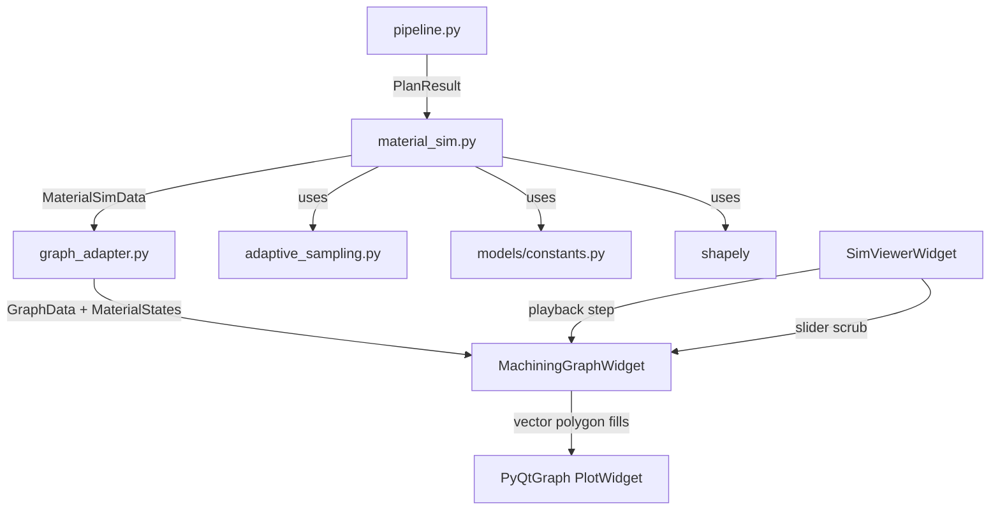

# Design Document: Material Removal Simulation

## Overview

This feature replaces the static rasterized zone shading in `MachiningGraphWidget` with a dynamic, vector-based material removal visualization. During simulation playback, the stock polygon progressively shrinks as each pass's swept region is subtracted — producing a real-time visual of the machining process that is geometrically identical to the post-planning validator's Shapely model.

The design introduces a **Simulation Engine** module (`outputs/material_sim.py`) that pre-computes all material states after the pipeline completes. The existing `graph_adapter.py` serializes these Shapely polygons into plain coordinate arrays, and the `MachiningGraphWidget` renders them as vector polygon fills — keeping the GUI layer free of any Shapely dependency.

### Key Design Decisions

1. **Pre-computation over per-frame computation**: All polygon subtractions happen once after pipeline completion (< 200ms budget). Playback simply indexes into pre-computed states — zero geometry work per frame.

2. **Vector rendering replaces raster**: The current `_draw_zones_as_image()` rasterization is replaced with PyQtGraph `PlotCurveItem` + `FillBetweenItem` for the material polygon. This gives zoom-independent sharpness and enables per-frame polygon updates without re-rasterizing.

3. **Same geometric primitives as the validator**: The simulation engine uses the same `adaptive_densify_arc()`, `SHAPELY_COS_LIMIT`, and `MAX_DENSIFICATION_DEPTH` constants as `polygon_builder.py`, guaranteeing geometric identity.

4. **Graph adapter as the serialization boundary**: Shapely polygons are converted to numpy coordinate arrays in `graph_adapter.py`. The GUI never imports Shapely.

## Architecture



### Data Flow

1. **Pipeline completes** → produces `PlanResult` with `TurningPass` objects (each carrying moves and pass bounds)
2. **`material_sim.compute()`** → takes `PlanResult`, constructs stock polygon, computes swept regions per pass, performs sequential subtraction, produces `MaterialSimData`
3. **`graph_adapter.convert()`** → serializes `MaterialSimData` polygons into coordinate arrays, adds them to `GraphData`
4. **`MachiningGraphWidget.set_graph_data()`** → receives coordinate arrays, creates vector fill items
5. **During playback** → `SimViewerWidget` calls `graph.set_material_state(pass_index)` or `graph.set_partial_material(pass_index, progress)` to update the displayed polygon

## Components and Interfaces

### 1. Material Simulation Engine (`outputs/material_sim.py`)

**Responsibility**: Pre-compute all material removal states from a PlanResult.

```python
"""Material removal simulation engine.

Pre-computes material states for playback visualization.
Uses Shapely for polygon operations — same parameters as the validator.

Imports from: models/, geometry/ only (no GUI dependencies)
"""

from dataclasses import dataclass, field
from typing import List, Tuple, Optional
import numpy as np
from shapely.geometry import Polygon, MultiPolygon
from shapely.ops import unary_union
from shapely.validation import make_valid

from models.results import PlanResult, TurningPass, SweptRegion
from models.moves import ToolMove, MoveType, PassType
from models.stock import StockDef
from models.profile import MachiningMode
from models.constants import SHAPELY_COS_LIMIT, MAX_DENSIFICATION_DEPTH, TOLERANCE
from geometry.adaptive_sampling import adaptive_densify_arc


@dataclass
class PassState:
    """Pre-computed material state after a pass completes."""
    pass_index: int
    pass_type: PassType
    # Exterior ring(s) as coordinate arrays (radius, inches)
    polygons: List[Tuple[np.ndarray, np.ndarray]]  # [(x_arr, z_arr), ...]
    # Move index range this pass covers in tool_moves
    move_start: int
    move_end: int


@dataclass
class MaterialSimData:
    """Complete pre-computed material simulation data."""
    # Initial stock polygon coordinates (radius, inches)
    stock_polygon: Tuple[np.ndarray, np.ndarray]  # (x_arr, z_arr)
    # Ordered sequence of pass states
    pass_states: List[PassState]
    # Per-move material states for smooth interpolation
    # Key: move_index → polygon coordinate arrays
    move_states: dict  # {int: List[Tuple[np.ndarray, np.ndarray]]}
    # Final state (stock minus all passes)
    final_state: List[Tuple[np.ndarray, np.ndarray]]
    # Metadata
    mode: MachiningMode
    total_passes: int
    computation_time_ms: float = 0.0


def compute(plan_result: PlanResult) -> MaterialSimData:
    """Pre-compute all material removal states from a PlanResult.
    
    Performance budget: < 200ms for profiles with up to 30 passes.
    """
    ...


def _build_stock_polygon(stock: StockDef, mode: MachiningMode) -> Polygon:
    """Construct the initial stock Shapely Polygon.
    
    OD mode: rectangle from x_start/2 to stock_diameter/2 (radius)
    ID mode: rectangle from pilot_hole_dia/2 to x_start/2 (radius)
    Z range: z_end to z_start
    """
    ...


def _compute_swept_region_polygon(
    turning_pass: TurningPass,
    tool_tnr: float,
    mode: MachiningMode,
) -> Polygon:
    """Compute the Shapely Polygon for a pass's swept material envelope.
    
    - Face/roughing passes: rectangular polygon from pass bounds
    - Cleanup/finish passes with arcs: curved band from TNR offset
    """
    ...


def _compute_arc_swept_band(
    moves: List[ToolMove],
    tnr: float,
) -> Polygon:
    """Compute swept band for arc-containing passes.
    
    Offsets the toolpath arc inward and outward by TNR,
    closes the boundary into a polygon.
    Uses adaptive_densify_arc with SHAPELY_COS_LIMIT.
    """
    ...


def _polygon_to_arrays(poly) -> List[Tuple[np.ndarray, np.ndarray]]:
    """Convert a Shapely Polygon or MultiPolygon to coordinate arrays.
    
    Returns list of (x_array, z_array) tuples — one per component polygon.
    Handles MultiPolygon by returning all components.
    """
    ...
```

### 2. Graph Adapter Extensions (`outputs/graph_adapter.py`)

**Changes**: Add material simulation data to `GraphData`.

```python
@dataclass
class MaterialStateData:
    """Pre-computed material state coordinate arrays for rendering."""
    stock_x: np.ndarray  # radius
    stock_z: np.ndarray  # inches
    pass_states: List[PassState]  # from material_sim
    final_x: List[np.ndarray]  # radius (one per component polygon)
    final_z: List[np.ndarray]  # inches


@dataclass
class GraphData:
    # ... existing fields ...
    material_states: Optional[MaterialStateData] = None
```

The `convert()` function gains an optional `material_sim_data` parameter:

```python
def convert(plan_result: PlanResult, material_sim_data: Optional[MaterialSimData] = None) -> GraphData:
    # ... existing conversion ...
    if material_sim_data:
        data.material_states = _convert_material_sim(material_sim_data)
    return data
```

### 3. MachiningGraphWidget Extensions (`gui/components/graph_widget.py`)

**New methods** for material state rendering:

```python
class MachiningGraphWidget(pg.PlotWidget):
    # ... existing methods ...

    def set_material_state(self, pass_index: int):
        """Display the pre-computed material state after pass_index completes.
        
        Used by slider scrubbing and step controls.
        Loads pre-computed coordinate arrays — no geometry computation.
        """
        ...

    def set_material_to_stock(self):
        """Reset material display to full stock polygon (Reset button)."""
        ...

    def set_material_to_final(self):
        """Display final material state (Show All button)."""
        ...

    def set_partial_material(self, pass_index: int, progress: float):
        """Display partial material removal within a pass.
        
        progress: 0.0 (pass start) to 1.0 (pass complete)
        Used during smooth playback within a cutting move.
        """
        ...

    def _render_material_polygon(self, coord_arrays: List[Tuple[np.ndarray, np.ndarray]]):
        """Update the vector polygon fill items for material display.
        
        Uses PlotCurveItem + FillBetweenItem for zoom-independent rendering.
        Handles MultiPolygon (multiple fill items).
        """
        ...
```

### 4. SimViewerWidget Integration (`gui/components/sim_viewer.py`)

**Changes**: Wire material state updates into the existing playback loop.

```python
class SimViewerWidget(QWidget):
    def _update_display(self):
        # ... existing tool dot + toolpath reveal ...
        
        # Material removal update
        if self._material_enabled and self._graph._material_states:
            move_idx = self._path[self._sim_step][2]
            self._graph.update_material_for_move(move_idx)

    def _sim_show_all(self):
        # ... existing show all ...
        self._graph.set_material_to_final()

    def _sim_stop(self):
        # ... existing reset ...
        self._graph.set_material_to_stock()
```

## Data Models

### SweptRegion Polygon Types

| Pass Type | Polygon Shape | Construction Method |
|-----------|--------------|-------------------|
| Face | Rectangle | `box(x_min_r, z_end, x_max_r, z_start)` |
| Roughing | Rectangle | `box(x_min_r, z_end, x_max_r, z_start)` |
| Cleanup (arcs) | Curved band | TNR offset of arc path |
| Finish (arcs) | Curved band | TNR offset of arc path |
| Cleanup (linear) | Rectangle | `box(x_min_r, z_end, x_max_r, z_start)` |
| Finish (linear) | Rectangle | `box(x_min_r, z_end, x_max_r, z_start)` |

### Stock Polygon Construction

```
OD Mode:
  X range: [x_start / 2, stock_diameter / 2]  (radius)
  Z range: [z_end, z_start]                    (inches)

ID Mode:
  X range: [pilot_hole_dia / 2, x_start / 2]  (radius)
  Z range: [z_end, z_start]                    (inches)
```

### Pass State Indexing

```
pass_states[0] = stock - swept_region[0]
pass_states[1] = stock - swept_region[0] - swept_region[1]
...
pass_states[N-1] = stock - union(all swept_regions) = final_state
```

### Move-to-Pass Mapping

Each `TurningPass` carries a `moves` list. The `SimViewerWidget` maps the current `move_index` (from the interpolated path) back to the owning pass via `ToolMove.pass_index`. During a cutting move within a pass, partial material removal is computed as:

```
partial_swept = clip(full_swept_region, z_start to current_z)
displayed_material = previous_pass_state - partial_swept
```

## Correctness Properties

*A property is a characteristic or behavior that should hold true across all valid executions of a system — essentially, a formal statement about what the system should do. Properties serve as the bridge between human-readable specifications and machine-verifiable correctness guarantees.*

### Property 1: Rectangular SweptRegion bounds correctness

*For any* face or roughing TurningPass with bounds (x_min, x_max, z_start, z_end), the computed SweptRegion Shapely Polygon SHALL have its bounding box equal to (x_min/2, z_end, x_max/2, z_start) in radius coordinates.

**Validates: Requirements 1.1**

### Property 2: Arc swept band width equals 2×TNR

*For any* cleanup or finish pass containing arc moves with tool nose radius TNR, the computed SweptRegion polygon's width (measured perpendicular to the arc centerline at any point) SHALL be within TOLERANCE of 2×TNR.

**Validates: Requirements 1.2, 1.3**

### Property 3: Coordinate convention invariant

*For any* TurningPass, all X coordinates in the computed SweptRegion polygon SHALL be in RADIUS (not diameter), and all Z coordinates SHALL be in INCHES, matching the Validator's polygon_builder coordinate convention.

**Validates: Requirements 1.4, 7.2**

### Property 4: Sequential subtraction produces correct Pass_States

*For any* ordered sequence of N TurningPasses with valid SweptRegion polygons, `pass_states[i]` SHALL equal `stock_polygon.difference(union(swept_regions[0..i]))` for all i in [0, N-1], and `len(pass_states)` SHALL equal N.

**Validates: Requirements 2.1, 2.2**

### Property 5: Per-move swept regions exist for cutting moves only

*For any* TurningPass, per-move swept region entries SHALL exist for every move where `move_type` is FEED, ARC_CW, or ARC_CCW, and SHALL NOT exist for moves where `move_type` is RAPID.

**Validates: Requirements 2.3**

### Property 6: Polygon-to-coordinate-array round trip

*For any* valid Shapely Polygon (non-empty, non-degenerate), converting to numpy coordinate arrays and reconstructing a Shapely Polygon from those arrays SHALL produce a geometrically equivalent polygon (symmetric difference area < TOLERANCE²).

**Validates: Requirements 2.5, 10.1**

### Property 7: Stock polygon bounds match mode parameters

*For any* StockDef with mode OD, the stock polygon X range SHALL be [x_start/2, diameter/2]. *For any* StockDef with mode ID, the stock polygon X range SHALL be [pilot_hole_dia/2, x_start/2]. In both cases, Z range SHALL be [z_end, z_start].

**Validates: Requirements 3.2, 3.3**

### Property 8: No material removal during rapids

*For any* move in the toolpath where `move_type == RAPID`, the material state polygon before and after that move SHALL be geometrically identical (symmetric difference area == 0).

**Validates: Requirements 4.4**

### Property 9: Reset restores initial stock polygon

*For any* material simulation state (after any number of passes have been applied), calling reset SHALL produce a material polygon geometrically identical to the initial stock polygon.

**Validates: Requirements 6.1**

### Property 10: SweptRegion does not penetrate finished part beyond tolerance

*For any* TurningPass where the validator confirms no gouge, the intersection area between the SweptRegion polygon and the finished_part_poly SHALL be less than TOLERANCE² (0.00000025 sq in).

**Validates: Requirements 7.3**

### Property 11: Slider position maps to correct Pass_State

*For any* slider position corresponding to move_index M, the displayed material state SHALL equal `pass_states[K]` where K is the index of the last completed pass at or before move M in the toolpath sequence.

**Validates: Requirements 8.4**

### Property 12: Subtraction direction matches machining mode

*For any* OD pass subtraction, the remaining material's maximum X (radius) SHALL be less than or equal to the stock's maximum X. *For any* ID pass subtraction, the remaining material's minimum X (radius) SHALL be greater than or equal to the stock's minimum X.

**Validates: Requirements 9.1, 9.2**

## Error Handling

| Error Condition | Handling Strategy |
|----------------|-------------------|
| SweptRegion polygon is invalid/degenerate | Apply `shapely.validation.make_valid()`, log warning, continue pipeline |
| Polygon subtraction produces empty result | Log warning, display empty material (all removed) |
| Polygon subtraction produces MultiPolygon | Retain all components, render each as separate fill |
| Material sim computation exceeds 200ms | Log timing warning, still produce valid result (no hard failure) |
| PlanResult has zero passes | Return stock polygon as both initial and final state |
| Arc densification produces degenerate points | Fall back to chord (straight line between start/end) |
| Graph widget receives empty coordinate arrays | Skip rendering that polygon, no crash |
| Slider scrub to position with no completed passes | Display full stock polygon |

### Graceful Degradation

If `material_sim.compute()` fails for any reason, the system falls back to the existing static zone shading. The `GraphData.material_states` field is `Optional` — when `None`, the widget renders zones as before (rasterized image). This ensures the feature never blocks the existing workflow.

## Testing Strategy

### Property-Based Tests (Hypothesis)

The property-based testing library is **Hypothesis** (Python). Each property test runs a minimum of **100 iterations** with generated inputs.

Tests live in `tests/test_material_sim_properties.py`.

| Property | Generator Strategy |
|----------|-------------------|
| P1: Rectangular bounds | Random x_min, x_max, z_start, z_end within stock bounds |
| P2: Arc band width | Random arc center, radius, TNR (0.005–0.125") |
| P3: Coordinate convention | Random TurningPass objects with mixed move types |
| P4: Sequential subtraction | Random stock + 1–15 non-overlapping swept regions |
| P5: Per-move cutting only | Random passes with mixed rapid/feed/arc moves |
| P6: Array round trip | Random simple polygons (4–20 vertices, convex hull) |
| P7: Stock bounds | Random StockDef parameters for both OD and ID modes |
| P8: No removal during rapids | Random toolpath sequences with rapids interspersed |
| P9: Reset restores stock | Random simulation states after 1–10 passes |
| P10: No finished part penetration | Passes from actual pipeline output (integration-style) |
| P11: Slider mapping | Random slider positions within valid move range |
| P12: Subtraction direction | Random passes for both OD and ID modes |

Tag format: `# Feature: material-removal-simulation, Property N: <property text>`

### Unit Tests

Unit tests in `tests/test_material_sim.py` cover:

- Stock polygon construction for specific OD/ID configurations
- Rectangular swept region for a known face pass
- Arc swept band for a known cleanup pass with specific I/K/TNR
- MultiPolygon handling when subtraction splits material
- Show All loads final state correctly
- Reset clears to stock
- Empty PlanResult (zero passes) produces stock-only result
- Degenerate polygon recovery via make_valid

### Integration Tests

Integration tests in `tests/test_material_sim_integration.py` cover:

- Full pipeline → material_sim → graph_adapter → GraphData round trip
- Performance: < 200ms for 30-pass OD profile
- Performance: Show All displays in < 16ms (pre-computed array load)
- Compatibility: toolpath reveal still works alongside material removal
- Compatibility: sim_line_changed signal still emits during playback
- Visual regression: final material state matches validator's finished_part_poly complement
