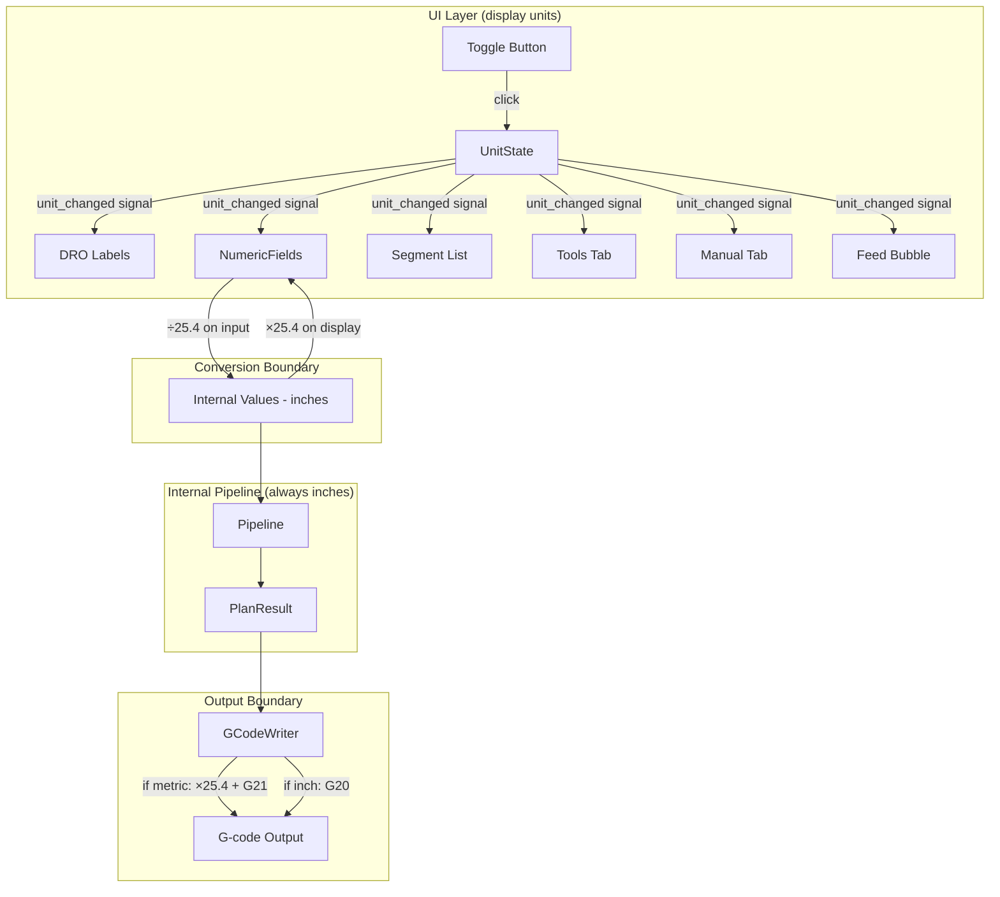

# Design Document: Metric/Inch Toggle

## Overview

This feature adds a metric/inch toggle to the Industry CAM Engine GUI, allowing CNC operators to work in either unit system. The design follows a strict boundary-conversion pattern: the internal pipeline remains in inches at all times, and conversion to/from millimeters happens exclusively at two boundaries:

1. **UI boundary** — NumericField, DRO, segment list, and tool display convert between internal inches and display millimeters.
2. **G-code output boundary** — GCodeWriter applies conversion during formatting when metric mode is active.

A new `UnitState` singleton manages the current mode and emits a Qt signal when it changes. All UI components subscribe to this signal and re-render their displayed values without touching stored data.

## Architecture



### Key Design Decision: Centralized UnitState

Rather than passing unit mode through every widget constructor, a single `UnitState` object (module-level singleton in `gui/unit_state.py`) holds the current mode and provides:
- A `unit_changed` signal that all display widgets connect to
- Helper methods `to_display(value_inches)` and `from_display(value_display)` for conversion
- Decimal place configuration per mode (4 for inch, 3 for metric)

This avoids threading a unit parameter through dozens of existing widget constructors and keeps the change surface minimal.

## Components and Interfaces

### 1. UnitState (`gui/unit_state.py`)

```python
class UnitMode(Enum):
    INCH = "inch"
    METRIC = "metric"

class UnitState(QObject):
    """Singleton managing the active display unit system."""
    
    unit_changed = pyqtSignal(str)  # emits "inch" or "metric"
    
    CONVERSION_FACTOR = 25.4
    
    @property
    def mode(self) -> UnitMode: ...
    
    def toggle(self) -> None:
        """Switch between inch and metric."""
    
    def to_display(self, value_inches: float) -> float:
        """Convert internal inches to display value."""
    
    def from_display(self, value_display: float) -> float:
        """Convert display value to internal inches."""
    
    @property
    def decimals(self) -> int:
        """4 for inch, 3 for metric."""
    
    @property
    def is_metric(self) -> bool: ...
    
    @property
    def length_suffix(self) -> str:
        """'in' or 'mm'"""
    
    @property
    def feed_suffix(self) -> str:
        """'in/min' or 'mm/min'"""

# Module-level singleton
unit_state = UnitState()
```

### 2. Toggle Button (in StatusBar)

A `QPushButton` inserted between the Feed bubble and Tool bubble in `StatusBar._setup_ui()`. Styled as a bubble matching the existing status bar aesthetic.

```python
# In StatusBar._setup_ui(), after feed_box and before tool_box:
self._unit_toggle = QPushButton("IN")
self._unit_toggle.setFixedSize(48, 36)
self._unit_toggle.setCursor(Qt.PointingHandCursor)
# Bubble style matching other status bar elements
self._unit_toggle.clicked.connect(self._on_unit_toggle)
```

The button displays "IN" (inch mode) or "MM" (metric mode) and uses a distinct background tint to indicate the active state.

### 3. NumericField Enhancement

`NumericField` gains unit-awareness:

- Stores its value internally in inches (unchanged from current behavior)
- On `unit_changed`, re-displays the stored value in the new unit system
- On user input in metric mode, divides by 25.4 before storing
- Adjusts suffix label and validation range based on active mode
- A `unit_aware: bool` flag in `NumericFieldConfig` controls whether the field participates in conversion (some fields like RPM and tool number are unit-independent)

```python
@dataclass(frozen=True)
class NumericFieldConfig:
    # ... existing fields ...
    unit_aware: bool = True  # False for RPM, tool number, pass count
```

### 4. GCodeWriter Enhancement

`GCodeWriter.write()` accepts an optional `unit_mode` parameter:

```python
def write(self, plan_result: PlanResult, unit_mode: str = "inch") -> str:
```

When `unit_mode == "metric"`:
- Safety preamble emits `G21` instead of `G20`
- All X, Z, I, K coordinates are multiplied by 25.4
- All F (feed) values are multiplied by 25.4
- Coordinate formatting uses 3 decimal places (`.3f`) instead of 4 (`.4f`)

The pipeline still produces PlanResult in inches. Conversion is purely a formatting concern in the writer.

### 5. StatusBar DRO and Feed Updates

`StatusBar.update_position()` and `StatusBar.update_feed()` check `unit_state.is_metric` and apply conversion before formatting the display labels. The raw inch values are still stored in `self._x_dia`, `self._z`, `self._feed` for internal use.

### 6. Segment List Conversion

`SegmentListWidget` subscribes to `unit_changed`. When the mode changes, it re-reads all rows from internal storage and re-displays them in the new unit. The underlying segment data (always in inches/diameter) is never modified.

### 7. Tools Tab Conversion

`Tools_Tab` subscribes to `unit_changed` and refreshes all displayed tool geometry values (nose radius, X offset, Z offset) by applying the conversion factor. Stored tool data remains in inches.

### 8. Manual Tab Conversion

The Manual tab's DRO, touch-off fields, and jog velocity display subscribe to `unit_changed`. Touch-off values entered in metric are converted to inches before being sent to LinuxCNC via HAL commands.

## Data Models

### UnitMode Enum

```python
class UnitMode(Enum):
    INCH = "inch"
    METRIC = "metric"
```

### NumericFieldConfig Extension

```python
@dataclass(frozen=True)
class NumericFieldConfig:
    min_value: float = -999999.0
    max_value: float = 999999.0
    decimals: int = 4
    default_value: float = 0.0
    suffix: str = ""
    placeholder: str = ""
    unit_aware: bool = True  # NEW: whether this field converts with unit toggle
```

### No Changes to Pipeline Data Models

`ClosedProfile`, `StockDef`, `ToolDef`, `ToolMove`, `PlanResult` — all remain unchanged. They store inches/diameter as before. The unit toggle is purely a presentation concern.

### File Format (JSON) — No Changes

The conversational program JSON format continues to store all values in inches. The `_write_program_file` and `_load_program_data` methods work with `NumericField.value()` which always returns inches regardless of display mode.

## Correctness Properties

*A property is a characteristic or behavior that should hold true across all valid executions of a system — essentially, a formal statement about what the system should do. Properties serve as the bridge between human-readable specifications and machine-verifiable correctness guarantees.*

### Property 1: Round-trip conversion preserves value

*For any* valid internal value in inches (within the range -999999 to 999999), converting to display value via `to_display()` and back to internal via `from_display()` SHALL produce a value within 0.000001 inches of the original.

**Validates: Requirements 7.4**

### Property 2: Display scaling is exactly 25.4×

*For any* internal value in inches, `to_display(value)` in metric mode SHALL return `value * 25.4`, and in inch mode SHALL return `value` unchanged. Conversely, `from_display(value)` in metric mode SHALL return `value / 25.4`.

**Validates: Requirements 3.1, 4.1, 4.2, 5.1, 9.1, 10.1, 11.1, 11.2**

### Property 3: Toggle does not mutate stored values

*For any* set of NumericField instances with stored internal values, toggling the Unit_Mode SHALL not change the value returned by `NumericField.value()` — only the displayed text changes.

**Validates: Requirements 4.3, 7.2, 9.3, 10.3**

### Property 4: File I/O is unit-mode invariant

*For any* conversational program state (stock, roughing, finishing, segments), serializing to JSON SHALL produce identical content regardless of whether the active Unit_Mode is "inch" or "metric" at the time of save.

**Validates: Requirements 8.1, 8.3**

### Property 5: G-code preamble matches unit mode

*For any* valid PlanResult, writing G-code in metric mode SHALL emit `G21` in the safety preamble (and NOT `G20`), and writing in inch mode SHALL emit `G20` (and NOT `G21`).

**Validates: Requirements 6.1, 6.4**

### Property 6: G-code value scaling is consistent

*For any* PlanResult containing ToolMoves with coordinates and feed rates, writing G-code in metric mode SHALL produce coordinate values (X, Z, I, K) and feed values (F) that equal the inch-mode values multiplied by 25.4, within a tolerance of 0.0005 mm.

**Validates: Requirements 6.2, 6.3**

### Property 7: G-code decimal formatting matches unit mode

*For any* coordinate or feed value in G-code output, metric mode SHALL format with exactly 3 decimal places and inch mode SHALL format with exactly 4 decimal places.

**Validates: Requirements 3.3, 6.5**

## Error Handling

| Scenario | Handling |
|----------|----------|
| Floating-point drift after repeated conversions | Values are stored in inches; conversion only happens at display time. No accumulation. |
| User enters value at metric validation boundary | Validation range is scaled by 25.4 in metric mode. Edge values are clamped after conversion to inches. |
| Toggle during active editing | `editingFinished` is not triggered by toggle. The field re-displays the last committed value in the new unit. In-progress edits are discarded (same as current focus-loss behavior). |
| G-code writer receives unexpected unit_mode | Default to "inch" (existing behavior). No silent fallback — if an invalid string is passed, raise ValueError. |
| File loaded while in metric mode | File values (always inches) are loaded into fields via `set_value()` which stores inches. Display conversion happens automatically via `unit_changed` signal. |

## Testing Strategy

### Property-Based Tests (Hypothesis)

Property-based testing is appropriate for this feature because:
- The conversion logic is a pure function with clear input/output behavior
- Universal properties (round-trip, scaling) hold across a wide numeric range
- The input space (all valid inch measurements) is large and continuous

**Library:** Hypothesis (already used in the project)
**Minimum iterations:** 100 per property

Each property test will be tagged with:
```python
# Feature: metric-inch-toggle, Property N: <property text>
```

Tests to implement:

1. **Property 1 — Round-trip conversion** — `from_display(to_display(x)) ≈ x` for all valid inch values within tolerance of 0.000001"
2. **Property 2 — Display scaling** — `to_display(x) == x * 25.4` in metric, `to_display(x) == x` in inch; `from_display(x) == x / 25.4` in metric
3. **Property 3 — Toggle invariance** — Set value on NumericField, toggle mode N times, verify `.value()` unchanged
4. **Property 4 — File I/O invariance** — Generate random program state dicts, serialize in both modes, verify identical JSON
5. **Property 5 — G-code preamble** — Generate random PlanResults, write in each mode, verify G20/G21 presence
6. **Property 6 — G-code value scaling** — Write same PlanResult in both modes, parse coordinates, verify metric = inch × 25.4
7. **Property 7 — Decimal formatting** — Write G-code in each mode, regex-verify coordinate decimal places (3 metric, 4 inch)

### Unit Tests (pytest)

- Toggle button text changes on click ("IN" ↔ "MM")
- Toggle button is positioned between feed bubble and tool bubble in layout
- DRO formats correctly in each mode (4dp inch, 3dp metric)
- Feed rate suffix changes ("in/min" ↔ "mm/min")
- NumericField suffix updates on toggle
- NumericField validation range scales correctly
- Default mode is "inch" on startup
- Mode does not persist across sessions (always starts "inch")
- Segment list values refresh on toggle without data mutation
- GCodeWriter emits G20/G21 correctly
- GCodeWriter formats F-word with conversion in metric mode
- Unit-independent fields (RPM, tool number, pass count) are NOT converted on toggle

### Integration Tests

- Full pipeline → G-code generation in metric mode produces valid, parseable G-code
- Load a saved .json file in metric mode → fields display correct metric values
- Save in metric mode → file content identical to saving in inch mode
- Toggle mid-session → all visible values update simultaneously
